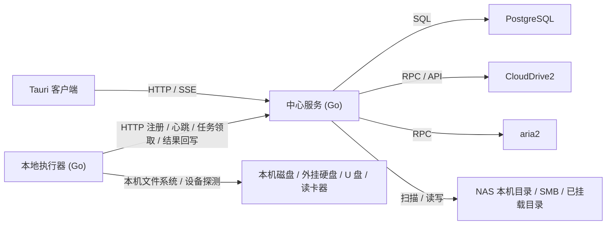
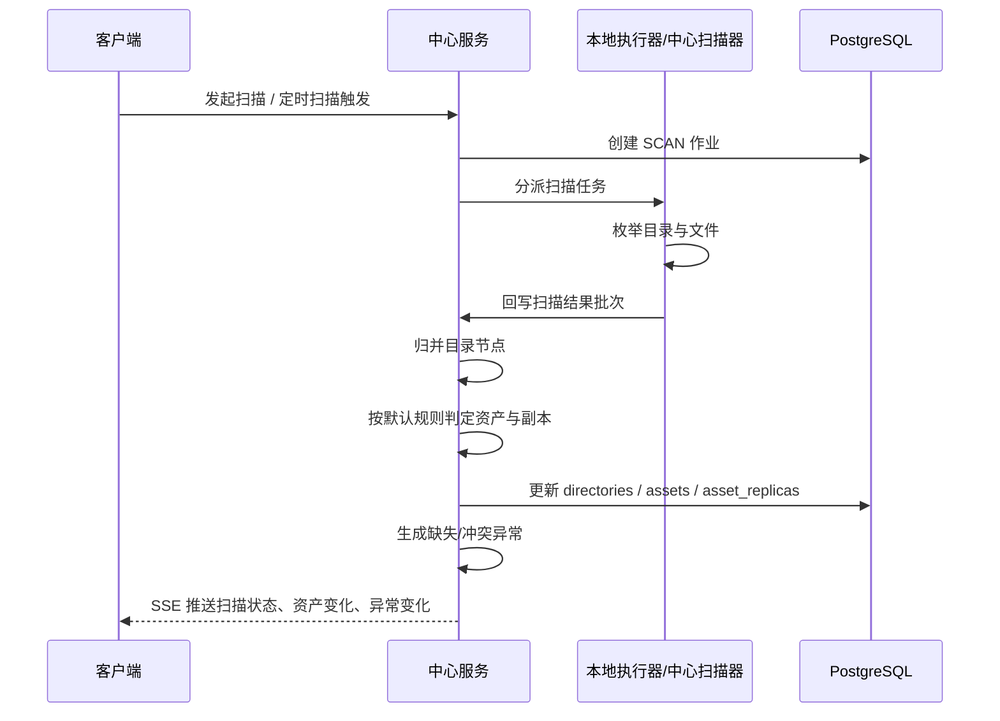
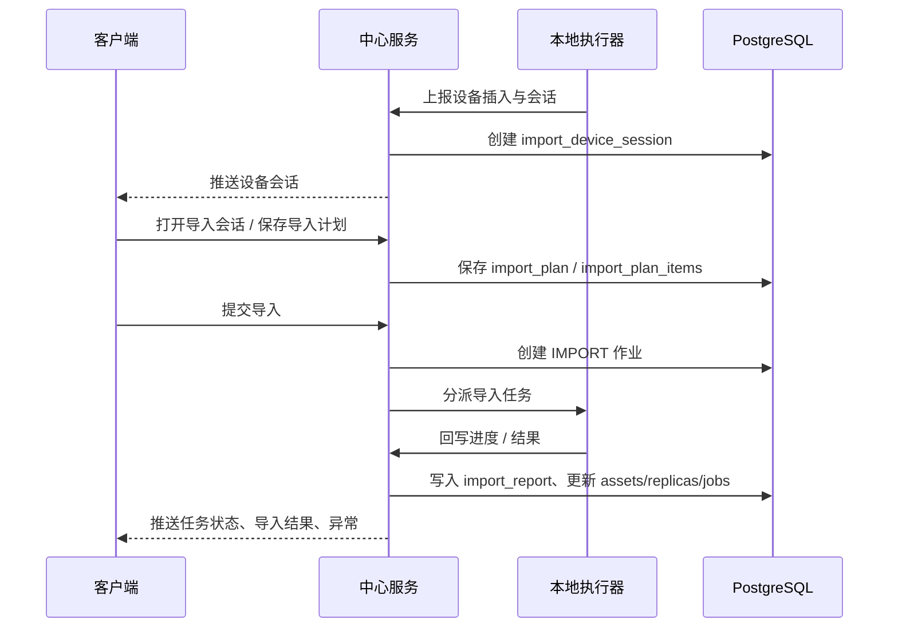
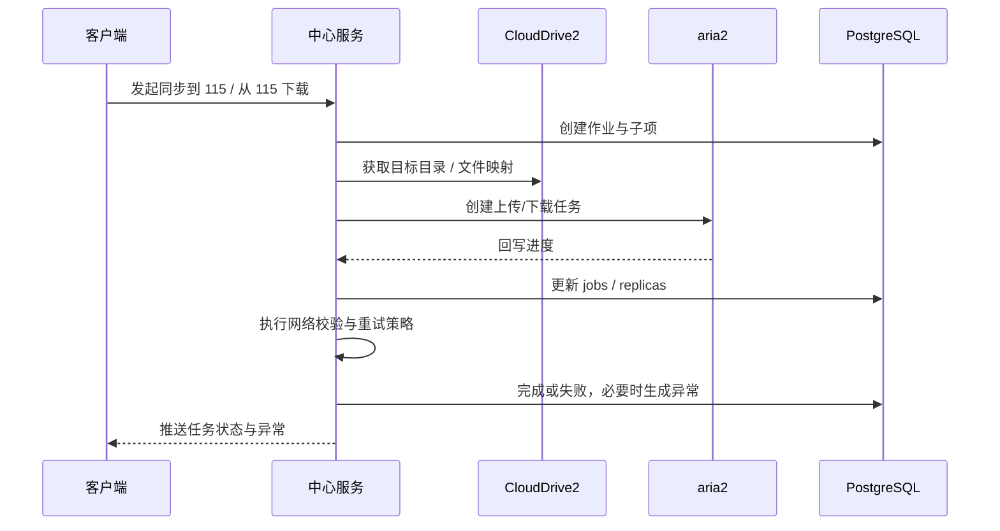
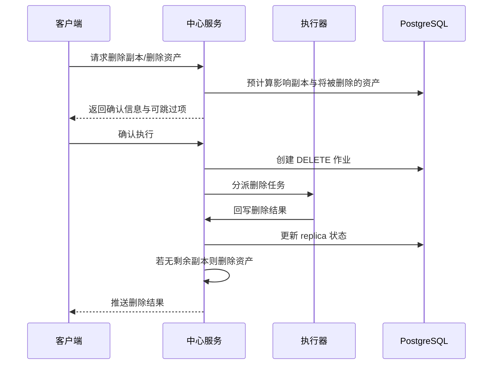
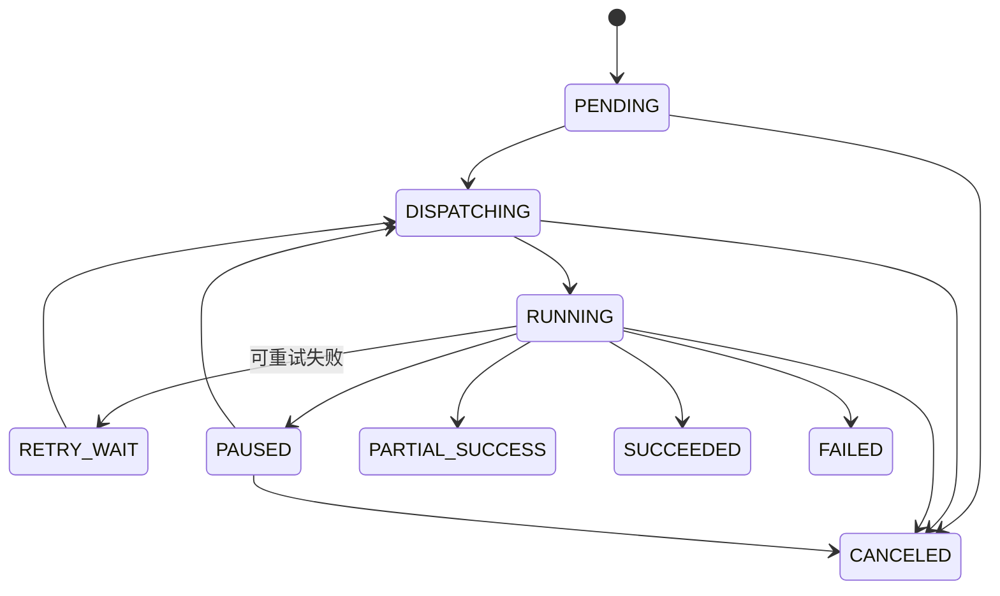
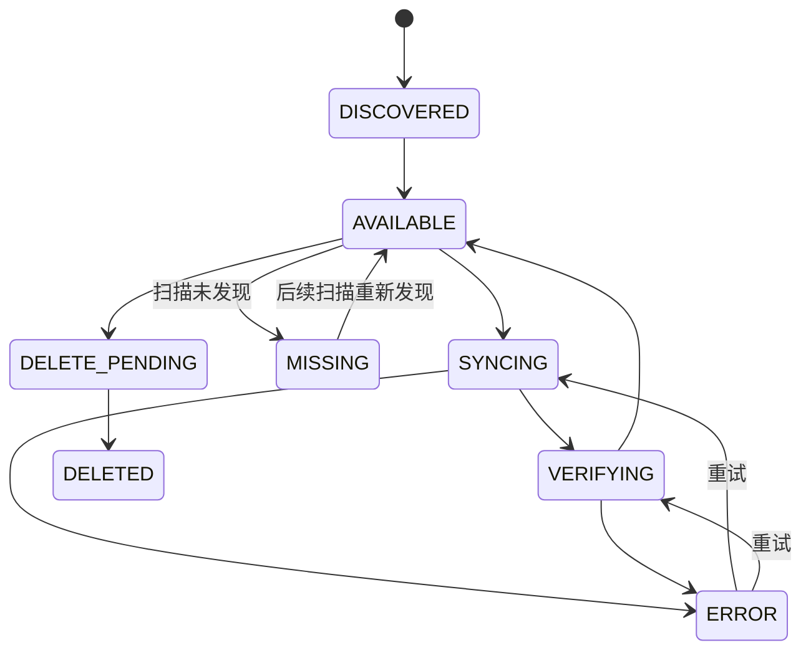
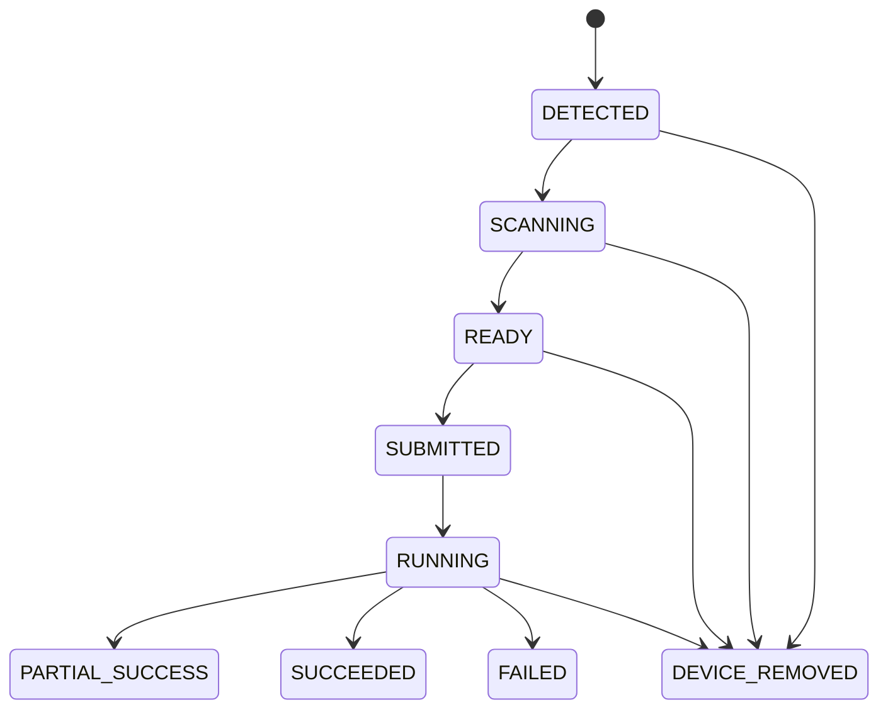

# 统一文件管理系统-后端及核心服务总体设计方案

## 文档说明

- 更新时间：2026-04-08
- 文档目标：为后续 AI 进行后端与核心服务实现提供可直接落地的总体设计基线
- 适用范围：`client` 现有桌面客户端、未来新增的中心服务、本地执行器、115 网盘接入能力
- 设计原则：不被当前前端 mock 架构绑定，但充分复用现有客户端中已经验证过的业务对象、交互闭环、状态机与命名语义

## 1. 设计结论

本项目后续正式形态定义为三段式架构：

1. 客户端：继续沿用现有 Tauri 桌面端，只负责界面化管理、状态查看、操作入口和少量桌面壳层能力。
2. 中心服务：使用 Go 实现，常驻运行，是唯一业务中枢与唯一权威数据源，负责扫描编排、任务调度、异常治理、115 接入编排、系统策略执行与客户端状态分发。
3. 本地执行器：使用 Go 实现，默认随客户端启动与关闭，负责导入设备、本机直连磁盘、外挂硬盘、U 盘等场景的探测与执行，可配置为常驻。

本方案明确采用 PostgreSQL 作为中心服务主数据库，采用“文件即资产”的统一资产模型，并把“同一路径下跨存储节点的文件副本聚合”为核心数据语义。

## 1.1 当前落地进度说明

截至 2026-04-08，仓库中已经落地了切片 0 所需的最小三段式底座，但尚未进入后续业务域实现阶段。

当前已落地部分：

- `services/center`
- `services/agent`
- `shared/contracts`
- PostgreSQL baseline migration
- 开发态 Docker PostgreSQL 编排
- 客户端顶层壳层系统状态灯接线

当前未落地部分：

- 资产域、存储域、作业域、异常域、导入域、通知域的真实业务实现
- SSE 业务事件流
- CloudDrive2 / aria2 / 115 集成
- 历史数据迁移与旧数据兼容

## 2. 已冻结设计前提

### 2.1 产品与运行前提

- 产品目标为单机单用户可用。
- 不拆产品一期 / 二期路线图，仅在网盘范围上当前只落 115。
- 客户端关闭后，中心服务仍需继续执行后台任务。
- 本地执行器是能力最小化组件，不承担权威状态存储，不承担全局业务编排。

### 2.2 统一资产前提

- 文件即资产，目录不是资产，但目录树是必须保留的物理路径视图。
- 一个资产库只允许有一个逻辑根目录。
- 资产库可以挂载多个存储节点，但这些挂载进入资产库后必须落在同一套根目录命名空间下。
- 文件中心目录树必须和物理路径强绑定，不能退化为纯逻辑目录树。

### 2.3 资产判定前提

- 默认判定规则：`相对路径 + 文件名 + 文件大小`。
- 归档后的定时或手动深度校验，采用“默认判定命中后，再做轻量 hash 校验”的二阶段方式。
- 如果扫描时发现相同路径候选文件无法通过默认规则稳定归并，则不自动合并，转为异常待处理。

### 2.4 执行与接入前提

- 中心服务统一调度作业。
- 本地执行器处理本机直连资源相关任务。
- 115 网盘通过 CloudDrive2 + aria2 接入。
- aria2 作为本项目二进制依赖随项目一起安装与运行。
- CloudDrive2 当前按配置方式接入；开发环境先通过 Docker 方式准备测试实例。

### 2.5 删除、校验、通知前提

- 删除副本后若无剩余副本，直接删除资产。
- 但在执行前，系统必须明确告知用户哪些删除会导致资产被直接删除，并允许跳过这些目标。
- 扫描时发现文件消失，先生成异常提醒，不直接删除资产。
- 导入任务与 115 上传下载任务默认采用网络校验，失败后按可配置次数自动重试。
- 通知状态先仅在当前客户端本地生效，不做跨客户端消费同步。

## 3. 目标与非目标

### 3.1 核心目标

- 建立统一的权威资产数据库，收口当前客户端多套本地数据源。
- 建立可常驻运行的中心服务，使任务执行与客户端生命周期解耦。
- 建立最小化本地执行器，承接本机资源发现与执行。
- 打通文件中心、导入中心、任务中心、异常中心、存储节点、通知中心的真实后端闭环。
- 为后续 AI 按模块、按任务包实施提供可直接参考的边界、库表、接口与状态机。

### 3.2 当前非目标

- 不做多人协同。
- 不做多客户端通知消费状态同步。
- 不做通用多租户系统。
- 当前不做“所有网盘”接入，只做 115。
- 当前不做完整媒体预览、缩略图流水线、全文检索等增强能力。

## 4. 总体架构

### 4.1 运行拓扑



### 4.2 三段式职责划分

#### 客户端

- 展示文件中心、任务中心、异常中心、通知中心、导入中心、存储节点、设置页
- 发起用户操作命令
- 订阅中心服务的状态变更
- 管理本地执行器的启动、停止、常驻设置与退出提醒
- 持有仅属于当前客户端的本地偏好与通知消费状态

#### 中心服务

- 作为唯一权威数据源管理资产库、目录树、资产、副本、作业、异常、系统策略
- 统一调度扫描、导入、复制、上传、下载、删除、校验、清理等任务
- 负责 115 接入编排
- 负责向客户端提供查询接口、命令接口、SSE 事件流
- 负责接收本地执行器注册、心跳、结果回写

#### 本地执行器

- 探测本机可移动介质与导入设备
- 执行本机资源相关扫描与文件操作
- 回写执行结果、进度、异常与探测状态
- 按配置决定是否在客户端退出后继续驻留

### 4.3 为什么采用三段式

这种架构同时满足三件事：

1. 保留现有桌面客户端强交互、强工作台的优势。
2. 让中心服务摆脱客户端进程生命周期，真正成为后台中枢。
3. 把必须依赖本机环境的能力收敛到最小执行器，避免把中心服务和桌面外设强耦合。

## 5. 技术选型与关键决策

### 5.1 技术栈

| 层 | 技术选型 | 说明 |
| --- | --- | --- |
| 客户端 | Tauri + React + TypeScript | 继续沿用现有实现 |
| 中心服务 | Go | 负责核心业务编排与 API |
| 本地执行器 | Go | 负责本机资源探测与执行 |
| 主数据库 | PostgreSQL | 权威主存储 |
| 实时状态 | SSE | 优先满足单用户、低复杂度、易调试 |
| 网盘接入 | CloudDrive2 + aria2 | 当前真实接入仅做 115 |
| 开发接入 | Docker 化 CD2、项目内集成 aria2 | 方便本地联调 |

### 5.2 关键设计决策

#### 决策 A：主数据库采用 PostgreSQL

- 优点：事务能力强、建模清晰、并发与约束能力完整、后续可扩展
- 代价：部署复杂度高于 SQLite
- 结论：接受代价，换取清晰的数据一致性和后续扩展空间

#### 决策 B：客户端不再承载业务权威状态

- 优点：任务与客户端生命周期解耦，业务状态唯一
- 代价：客户端改造量较大
- 结论：必须执行

#### 决策 C：默认资产判定不做强 hash

- 优点：日常扫描快、实现复杂度可控
- 代价：极端情况下无法仅靠默认规则解决歧义
- 结论：默认使用路径 + 文件名 + 大小，归档后再提供增强校验

#### 决策 D：通知消费状态只保存在客户端本地

- 优点：实现轻、符合当前单机单用户目标
- 代价：不同客户端之间不会共享“已读/已跳转”
- 结论：当前接受

## 6. 业务域划分

### 6.1 资产域

负责：

- 资产库
- 逻辑目录树
- 文件资产
- 资产副本
- 资产生命周期
- 文件元数据、标签、标记、备注

边界：

- 文件是资产
- 目录不是资产，但必须作为独立目录树节点存在
- 副本状态属于资产副本，不属于资产本体

### 6.2 存储域

负责：

- 存储节点注册
- 节点类型与能力声明
- 节点挂载到资产库的关系
- 节点健康状态、扫描策略、连接测试状态
- 115 接入配置

### 6.3 作业域

负责：

- 作业主记录
- 作业子项
- 执行分派
- 重试、取消、暂停、恢复
- 进度回写
- 事件流与审计轨迹

### 6.4 导入域

负责：

- 设备会话
- 导入草稿 / 导入计划
- 预检摘要
- 导入报告
- 与本地执行器的探测、扫描、执行协作

### 6.5 异常域

负责：

- 异常生成
- 来源上下文
- 影响范围
- 治理动作
- 处理历史

### 6.6 通知域

负责：

- 生成面向客户端的通知消息
- 提供可跳转目标

边界：

- 中心服务只提供通知源数据与通知事件
- “已读 / 已跳转 / 已消费”仍由客户端本地维护

### 6.7 系统策略域

负责：

- 重试次数
- 校验策略
- 扫描频率
- 删除确认策略
- 后台调度窗口

边界：

- 影响核心业务的统一配置在中心服务
- 仅影响界面和体验的配置继续留在客户端本地

## 7. 推荐代码组织

## 7.1 仓库推荐结构

```text
client/                         # 现有 Tauri 客户端
services/
  center/
    cmd/mare-center/
    internal/
      app/
      modules/
        library/
        storage/
        asset/
        replica/
        tag/
        job/
        importplan/
        issue/
        setting/
        notification/
        integration/
          cd2/
          aria2/
      infra/
        db/
        http/
        sse/
        scheduler/
        queue/
    migrations/
  agent/
    cmd/mare-agent/
    internal/
      app/
      modules/
        discovery/
        device/
        localfs/
        importer/
        transfer/
        heartbeat/
        reporter/
shared/
  contracts/
    openapi/
    events/
    dto/
docs/
  后端及核心服务/
```

## 7.2 中心服务模块职责

| 模块 | 职责 |
| --- | --- |
| `library` | 资产库、根目录、目录树命名空间 |
| `storage` | 存储节点、挂载关系、能力、连接状态 |
| `asset` | 文件资产、元数据、标记、路径索引 |
| `replica` | 资产副本、同步状态、校验状态、缺失状态 |
| `tag` | 标签、标签分组、作用域、资产标签关系 |
| `job` | 作业主表、子项、调度、进度、重试、事件 |
| `importplan` | 导入会话、预检、导入计划、导入报告 |
| `issue` | 异常生成、治理动作、历史 |
| `setting` | 系统策略配置 |
| `notification` | 面向客户端的通知事件生成 |
| `integration/cd2` | CloudDrive2 适配层 |
| `integration/aria2` | aria2 适配层 |

## 7.3 本地执行器模块职责

| 模块 | 职责 |
| --- | --- |
| `discovery` | 外挂设备与本机资源探测 |
| `device` | 设备会话、插拔事件 |
| `localfs` | 本机文件系统扫描与基础操作 |
| `importer` | 导入任务执行 |
| `transfer` | 本机到本机 / 本机到 NAS 的本地传输 |
| `heartbeat` | 注册、心跳、能力上报 |
| `reporter` | 任务进度、异常、结果回写 |

## 8. 存储与目录模型

### 8.1 单资产库单逻辑根

每个资产库只有一个逻辑根目录，例如 `/`。不同存储节点通过“挂载关系”进入这一个逻辑根命名空间。

例如：

- 本机节点挂载 `C:\assets-root`
- 另一块磁盘节点挂载 `D:\assets-root`
- NAS 节点挂载 `/mnt/media-root`
- 115 节点挂载 `/CloudDrive/115/assets-root`

当这些节点被挂载到同一个资产库时，它们都向同一个逻辑根贡献目录与文件树。

### 8.2 目录树合并规则

- 目录树按相对路径合并。
- 目录节点按 `library_id + relative_path` 唯一。
- 同一路径下来自不同挂载的目录会聚合成同一个目录节点。
- 同一路径下的文件若满足默认资产判定规则，则聚合为同一资产的多个副本。
- 同一路径下的文件若无法通过默认判定规则稳定归并，则生成路径冲突异常，不自动合并。

## 9. 核心数据模型

## 9.1 数据库分组

中心服务数据库建议分为以下几组表：

1. 资产与目录
2. 存储节点与挂载
3. 标签
4. 作业
5. 导入
6. 异常
7. 系统策略与运行时

## 9.2 核心表清单

详细字段、约束、索引和关系，现以 `docs/数据库设计/` 下的专题文档为准。总体方案只保留摘要和引用，避免与数据库设计文档重复维护后再次分叉。

### A. 资产与目录

详细设计见：

- [统一文件管理系统-资产域数据库设计.md](B:/new_project/mare/docs/数据库设计/统一文件管理系统-资产域数据库设计.md)

核心表：

- `libraries`
- `library_directories`
- `assets`
- `asset_replicas`
- `directory_presences`
- `asset_metadata`

关键口径：

- 资产唯一性按 `(library_id, relative_path)` 确定
- 一个资产库只允许一个逻辑根目录
- `asset_replicas` 通过 `mount_id` 关联挂载，不重复持有存储节点主事实

### B. 存储节点与挂载

详细设计见：

- [统一文件管理系统-存储域数据库设计.md](B:/new_project/mare/docs/数据库设计/统一文件管理系统-存储域数据库设计.md)

核心表：

- `storage_nodes`
- `storage_node_credentials`
- `storage_node_runtime`
- `mounts`
- `mount_runtime`

关键口径：

- 节点本体与挂载关系分离
- 静态配置、敏感凭据、运行时状态分表
- 存储域与资产域的桥梁是 `mounts`

### C. 标签

标签域当前仍建议延续现有设计方向：

- `tag_groups`
- `tags`
- `tag_library_scopes`
- `asset_tag_links`

其中 `entry_tag_links` 演进为 `asset_tag_links`。

### D. 作业

详细设计见：

- [统一文件管理系统-任务域数据库设计.md](B:/new_project/mare/docs/数据库设计/统一文件管理系统-任务域数据库设计.md)

核心表：

- `jobs`
- `job_items`
- `job_attempts`
- `job_events`
- `job_object_links`

关键口径：

- 使用统一任务模型，不按“传输任务 / 其他任务”分表
- 一次用户动作生成一个主任务
- 多目标时按“文件或资产 x 目标挂载”拆任务子项
- 重试不生成新主任务，而是新增 `attempt`

### E. 导入

导入域仍按以下对象建模：

- `import_device_sessions`
- `import_plans`
- `import_plan_items`
- `import_reports`

当前总体方案保持这一层摘要，详细表设计待单独数据库设计文档冻结。

### F. 异常

详细设计见：

- [统一文件管理系统-异常域数据库设计.md](B:/new_project/mare/docs/数据库设计/统一文件管理系统-异常域数据库设计.md)

核心表：

- `issues`
- `issue_events`
- `issue_object_links`

关键口径：

- 异常是治理对象，不是一次性错误日志
- 异常与任务、资产、副本、目录、挂载、存储节点统一通过关联表建模
- 异常能力优先由服务层按状态和来源推导，不直接固化为主表布尔字段

### G. 系统策略

#### `system_settings`

| 字段 | 类型 | 说明 |
| --- | --- | --- |
| `setting_key` | text primary key | 配置键 |
| `setting_value` | jsonb | 配置值 |
| `updated_at` | timestamptz | 更新时间 |

建议初期至少覆盖：

- `jobs.retry_limit.default`
- `jobs.verify_policy.import`
- `jobs.verify_policy.upload_115`
- `jobs.verify_policy.download_115`
- `jobs.scan.schedule`
- `delete.require_impacted_asset_confirm`

## 10. 关键接口边界

## 10.1 客户端 -> 中心服务

建议优先采用 HTTP + SSE：

- HTTP：命令与查询
- SSE：任务、异常、扫描、存储节点状态实时推送

建议接口分组：

- `/api/libraries/*`
- `/api/storage/*`
- `/api/assets/*`
- `/api/tags/*`
- `/api/jobs/*`
- `/api/imports/*`
- `/api/issues/*`
- `/api/settings/*`
- `/api/events/stream`

## 10.2 本地执行器 -> 中心服务

建议接口分组：

- `POST /agent/register`
- `POST /agent/heartbeat`
- `POST /agent/jobs/claim`
- `POST /agent/jobs/{id}/progress`
- `POST /agent/jobs/{id}/complete`
- `POST /agent/jobs/{id}/fail`
- `POST /agent/device-sessions/upsert`
- `POST /agent/scan-results`

## 10.3 中心服务 -> CloudDrive2 / aria2

由中心服务内部适配层封装，不直接暴露给客户端。

## 11. 任务执行归属矩阵

| 任务类型 | 执行主体 | 说明 |
| --- | --- | --- |
| 本机外挂设备扫描 | 本地执行器 | 需要本机设备探测能力 |
| 导入设备预检 | 本地执行器 | 贴近设备执行 |
| 导入执行 | 本地执行器 | 本机读卡器/U 盘/硬盘 |
| 本机到本机复制 | 本地执行器 | 本机路径之间复制 |
| 本机到 NAS 复制 | 本地执行器 | 从本机资源发起 |
| NAS 目录扫描 | 中心服务 | 中心服务部署在 NAS 上，直接访问本地目录 |
| NAS 内部复制/删除 | 中心服务 | 不依赖本地电脑 |
| 115 上传 | 中心服务 + CD2 + aria2 | 中心服务统一编排 |
| 115 下载 | 中心服务 + CD2 + aria2 | 中心服务统一编排 |
| 归档后强校验 | 中心服务 | 定时或手动任务 |
| 删除副本 | 中心服务或本地执行器 | 取决于副本所在节点类型 |
| 删除资产 | 中心服务编排 | 本质为一组副本删除 + 元数据清理 |

## 12. 关键事件流

## 12.1 扫描入库事件流



## 12.2 导入事件流



## 12.3 115 上传下载事件流



## 12.4 删除事件流



## 13. 状态机设计

## 13.1 作业状态机



### 13.1.1 状态说明

- `PENDING`：已创建，尚未进入分派
- `DISPATCHING`：等待执行主体领取
- `RUNNING`：执行中
- `RETRY_WAIT`：等待按策略重试
- `PAUSED`：人工暂停
- `PARTIAL_SUCCESS`：部分成功
- `SUCCEEDED`：全部成功
- `FAILED`：最终失败
- `CANCELED`：已取消

## 13.2 资产副本状态机



## 13.3 导入设备会话状态机



## 14. 系统策略与客户端本地偏好边界

## 14.1 应进入中心服务的系统策略

- 扫描频率
- 重试次数
- 导入校验策略
- 115 上传下载校验策略
- 删除资产确认策略
- 后台任务并发限制
- 强校验任务配置

## 14.2 应保留在客户端本地的偏好

- 主题与外观
- 列表密度
- 默认打开页面
- 工作区标签恢复
- 通知中心本地消费状态
- 本地执行器是否随客户端自动启动
- 退出客户端时是否提醒保留本地执行器

## 15. 实施分段与任务包拆分

本节不是产品一期 / 二期规划，而是工程实施顺序。

## 15.1 实施分段

### 分段 A：基础脚手架与契约冻结

目标：

- 建立服务目录结构
- 冻结 OpenAPI / DTO / 事件模型
- 建立 PostgreSQL 迁移体系
- 建立中心服务与本地执行器基础启动骨架

主要模块：

- `services/center` 脚手架
- `services/agent` 脚手架
- `shared/contracts`
- 数据库迁移框架

当前状态：

- 中心服务脚手架：已完成
- 本地执行器脚手架：已完成
- 最小 DTO / OpenAPI 契约：已完成
- PostgreSQL baseline migration：已完成
- 开发态一键启动编排：已完成
- SSE 业务事件模型：未开始

风险：

- 契约未冻结就进入业务实现，后续返工成本极高

### 分段 B：资产库、存储节点、目录树核心闭环

目标：

- 打通资产库、存储节点、挂载、目录树、文件资产、副本的最小可用闭环
- 客户端文件中心改为从中心服务拉取数据，而不是从 `sql.js` 拉取

主要模块：

- `library`
- `storage`
- `asset`
- `replica`
- 目录树查询 API

风险：

- 相对路径归并、目录树合并规则如果实现不稳，会影响后续所有任务

### 分段 C：作业系统与异常系统

目标：

- 建立统一作业模型
- 打通任务中心所需的主任务 / 子项 / 事件流
- 打通异常生成和治理动作

主要模块：

- `job`
- `issue`
- `notification`

风险：

- 如果没有统一 job_events，任务中心和异常中心后续会再次分裂

### 分段 D：本地执行器与导入闭环

目标：

- 实现本地执行器注册、心跳、设备探测
- 打通导入设备会话、导入计划、导入执行、导入报告

主要模块：

- `worker_registrations`
- `import_device_sessions`
- `import_plans`
- agent `discovery` / `importer`

风险：

- 设备插拔与客户端退出时的本地执行器行为容易出现边界问题

### 分段 E：115 接入闭环

目标：

- 接入 CloudDrive2 与 aria2
- 打通 115 上传下载任务
- 落地网络校验与重试策略

主要模块：

- `integration/cd2`
- `integration/aria2`
- `SYNC_UPLOAD_115`
- `SYNC_DOWNLOAD_115`

风险：

- 外部依赖不稳定、状态回写链路复杂

### 分段 F：客户端全面迁移与治理收口

目标：

- 将客户端主要页面从本地 mock 数据切换到中心服务
- 收口设置边界
- 补齐通知、扫描、删除确认等跨页面联动

主要模块：

- `client/src/App.tsx` 编排迁移
- `fileCenterApi` 服务化替换
- `storageNodesApi` 改为中心服务模式

风险：

- 旧本地 mock 与新服务态并存期间，容易出现双源数据混乱

## 15.2 任务包清单

以下任务包适合交给 AI 分批实现。

### P0：基础设施与契约

1. 中心服务项目脚手架
2. 本地执行器项目脚手架
3. PostgreSQL 迁移体系
4. OpenAPI 契约文件
5. SSE 事件模型定义
6. CloudDrive2 / aria2 开发环境编排

截至当前：

- 1、2、3、4 已完成最小切片 0 落地
- 5 未开始
- 6 未开始

### P1：核心域建模

7. `libraries` / `library_directories` 迁移与读写
8. `storage_nodes` / `storage_node_credentials` / `storage_node_runtime` / `mounts` / `mount_runtime` 迁移与读写
9. `assets` / `asset_metadata` / `asset_replicas` / `directory_presences` 迁移与读写
10. 目录树合并查询服务
11. 默认资产判定服务
12. 标签域迁移与服务化

### P2：作业与异常

13. `jobs` / `job_items` / `job_attempts` / `job_events` / `job_object_links` 迁移与仓储
14. 作业状态机与调度器
15. `issues` / `issue_events` / `issue_object_links` 迁移与治理动作
16. 面向客户端的通知事件输出

### P3：本地执行器与导入

17. 本地执行器注册与心跳
18. 设备探测与设备会话回写
19. 导入计划接口
20. 导入作业执行与结果回写
21. 客户端退出时本地执行器保留提醒

### P4：115 集成

22. CD2 适配器
23. aria2 适配器
24. 115 上传作业执行链路
25. 115 下载作业执行链路
26. 网络校验与自动重试

### P5：客户端迁移

27. 文件中心改接中心服务
28. 任务中心改接中心服务
29. 异常中心改接中心服务
30. 导入中心改接中心服务
31. 存储节点页改接中心服务
32. 设置页拆分系统策略与本地偏好

## 15.3 先后依赖关系

### 必须先做

- P0 全部
- P1 中的资产库、存储节点、目录树、资产、副本
- P2 中的作业主表、子项表、事件表

### 可以并行

- 标签域服务化可以与目录树查询并行
- 异常域可在作业事件模型冻结后并行
- 本地执行器骨架可与中心服务 P0 并行
- CD2 适配器与 aria2 适配器可在作业框架稳定后并行

### 必须先写契约 / 迁移，再写业务实现

- OpenAPI / DTO / SSE 事件契约
- PostgreSQL 核心迁移
- 作业状态机枚举
- 存储节点能力模型
- 本地执行器注册协议
- 115 集成适配接口

补充说明：

- 当前仓库已冻结的是切片 0 所需最小运行态契约，不代表后续所有业务域 OpenAPI 已冻结
- 当前仓库已落地的是切片 0 baseline migration，不代表后续领域表已完成实现

## 16. 风险与缓解

### 风险 1：路径合并与副本归并规则复杂

- 缓解：先冻结“单库单根 + 相对路径唯一 + 默认判定 + 冲突转异常”规则，不在实现阶段再发散

### 风险 2：客户端迁移期间出现双数据源

- 缓解：以页面为单位逐步切换；每次切换后停用对应本地 mock 写入路径

### 风险 3：115 外部依赖不稳定

- 缓解：把 CD2 与 aria2 都封装在中心服务适配层内，不让页面或作业域直接感知其细节

### 风险 4：本地执行器生命周期复杂

- 缓解：先把“默认跟随客户端启动关闭、可配置常驻、退出时若仍有设备则提醒”做成明确状态机与设置项

### 风险 5：删除语义易造成误删

- 缓解：所有会导致资产直接删除的副本删除操作，必须先做服务端预计算并回传确认明细

## 17. 成功标准

- [ ] 中心服务成为唯一权威数据源，客户端不再依赖本地 `sql.js` / `localStorage` 作为业务主源
- [ ] 文件中心能基于真实目录树与副本状态展示资产
- [ ] 任务中心能展示真实作业主任务、子项和状态流转
- [ ] 异常中心能展示由扫描、传输、删除、导入产生的真实异常
- [ ] 导入中心能通过本地执行器完成真实设备会话、导入计划与导入执行
- [ ] 115 上传下载可通过 CloudDrive2 + aria2 真实跑通
- [ ] 删除确认链路能正确识别哪些副本删除会导致资产删除
- [ ] 通知中心能基于中心服务事件生成通知，但消费状态仅保留在当前客户端

## 18. 当前结论

截至本方案定稿，后端与核心服务的实现方向已经足够明确：

- 架构形态采用“客户端 + 中心服务 + 本地执行器”
- 主库采用 PostgreSQL
- 资产模型采用“文件即资产 + 多副本”
- 目录模型采用“单资产库单逻辑根 + 多挂载并入同一命名空间”
- 日常归并采用默认规则，归档后可做增强校验
- 任务、异常、通知、导入、115 接入都围绕中心服务统一编排

后续实现应优先按本方案中的模块边界、数据库结构、事件流和任务包拆分推进，避免再次回到以客户端页面为中心的本地编排模式。
