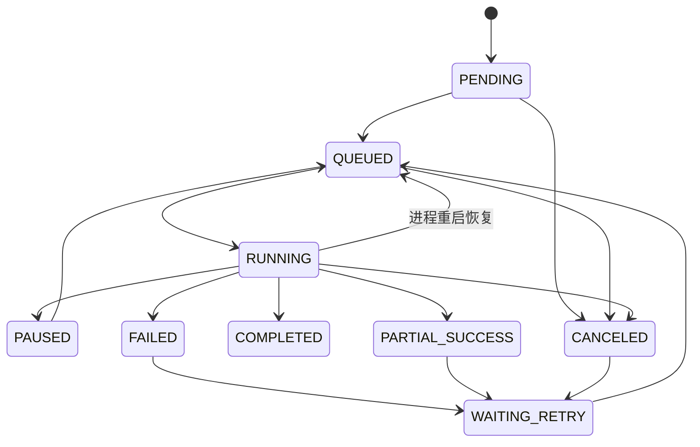
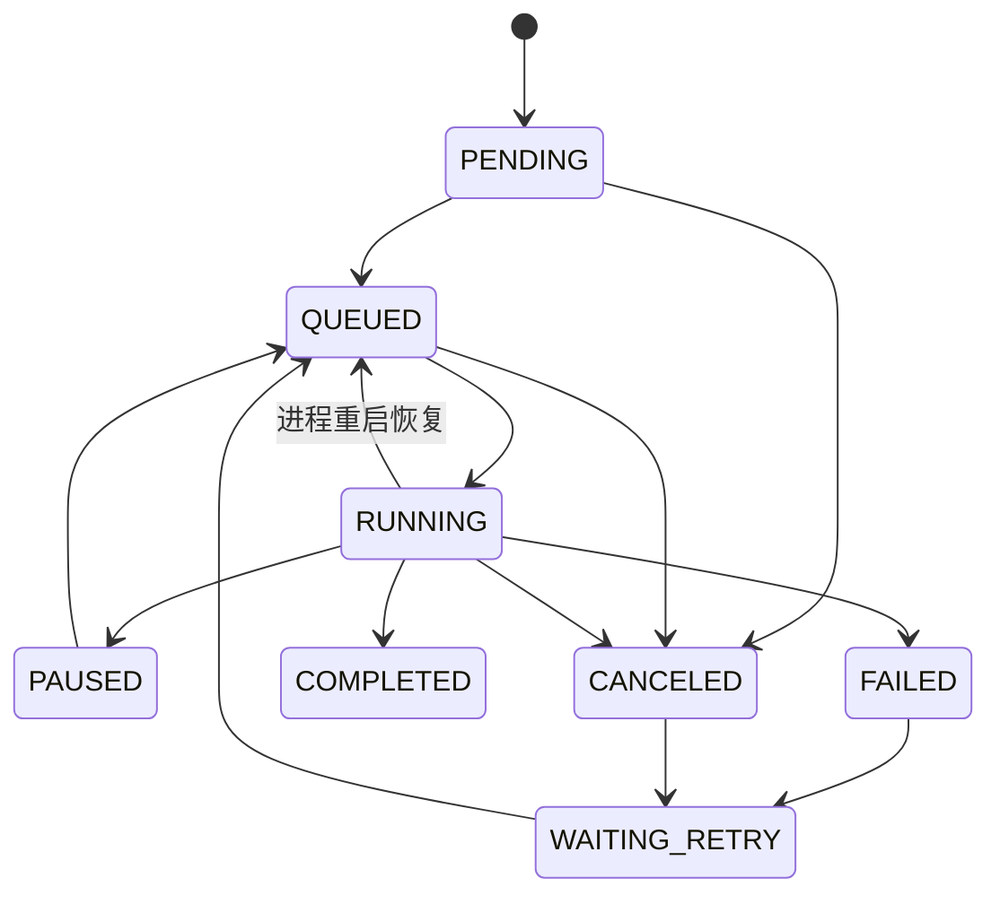

# 统一文件管理系统-网盘同步任务状态规划与任务拆分方案

## 文档说明

- 更新时间：2026-04-13
- 适用范围：`client`、`services/center`、`shared/contracts`
- 目标：为后续 AI 实现提供一份可直接执行的网盘同步任务规划与拆分文档
- 约束：
  - 所有“网盘同步任务”统一按真实代码现状规划，不混入未落地能力
  - 任务拆分最多 4 个，每个任务都必须可独立实现、验证和回归
  - 本文档优先解决 `115 / CloudDrive2 / aria2` 相关上传、下载、删除副本链路

## 1. 结论摘要

当前网盘同步链路的核心问题不是“缺少一个状态”，而是以下 4 件事同时存在但没有统一规划：

1. 内部任务状态、外部执行器状态、文件中心端点状态混用。
2. 上传和下载在“尚未进入真实传输阶段”时就开始展示进度和速度。
3. 下载链路把本地目标文件大小错误当成真实已下载字节，导致进度虚高甚至直接接近 100%。
4. 上传链路使用 `CloudDrive2` 的全局上传速度作为单任务速度来源，导致速度和 ETA 天然不准确。

本次规划统一将网盘同步任务拆成 4 层：

- 调度层：`Job`
- 执行层：`JobItem`
- 外部引擎层：`ExternalTask`
- 结果投影层：`EndpointProjection`

后续实现的核心原则：

- 一级任务展示内部调度状态，不直接用外部执行器状态替代。
- 二级任务展示“内部状态 + 外部阶段”，但两者严格分层。
- 进度、速度、ETA 必须受“阶段门控规则”控制，不允许在错误阶段展示。
- 文件中心端点状态只反映结果，不参与调度。

### 1.1 本轮实施范围

本轮文档只收口以下问题：

- `CloudDrive2` 上传阶段、进度、速度展示
- `aria2` 下载阶段、进度、速度、ETA 展示
- 任务中心与文件中心对上传/下载链路的状态投影一致性
- 与上述两条链路直接相关的恢复逻辑和回归测试

本轮明确不单独开新任务处理：

- 导入中心 `CLOUD` 目标端开放
- 云端删副本独立可观测性增强
- 异常中心、通知中心的专项改造
- 与本次进度异常无直接关系的普通 `COPY` 链路重构

说明：

- `DELETE_REPLICA` 与端点状态投影仍然遵守本文统一状态模型
- 但它不属于本轮“进度/速度异常修复”的主实施对象，不额外拆任务

## 2. 当前问题的根因归纳

### 2.1 下载进度直接到 100%

当前 `aria2` 下载真实进度应来自：

- `status`
- `completedLength`
- `totalLength`
- `downloadSpeed`

但当前实现还额外用目标文件本地大小兜底 `bytesDone`：

- 代码位置：[downloader_aria2.go](/B:/new_project/mare/services/center/internal/integration/downloader_aria2.go)
- 关键逻辑：`if localBytes > bytesDone { bytesDone = localBytes }`

问题在于 `aria2` 默认启用了续传与会话持久化，并且会出现目标文件被预分配的情况。此时本地文件大小可能等于完整文件大小，但真实下载并未完成。系统把该大小错误地当成 `bytesDone` 后，会导致：

- 子任务进度虚高
- 一级任务聚合进度虚高
- ETA 提前清零
- 详情页显示已接近完成，但实际未完成

因此，下载侧的本质问题是：

- 使用了不可靠的兜底数据源
- 把“文件占位大小”误当成“真实已下载大小”

### 2.2 上传进度一直不变化

当前 `CloudDrive2` 上传链路真实存在以下阶段：

- `WaitforPreprocessing`
- `Preprocessing`
- `Inqueue`
- `Transfer`
- `Pause`
- `Finish`
- `Cancelled`
- `Skipped`
- `Error`
- `FatalError`

代码来源：

- [provider_cd2_115.go](/B:/new_project/mare/services/center/internal/integration/provider_cd2_115.go)
- [clouddrive.pb.go](/B:/new_project/mare/services/center/internal/integration/cd2/pb/clouddrive.pb.go)

当前系统的问题是：

- 在 `WaitUpload()` 开始轮询后，就默认把任务视为“已进入真实传输阶段”
- 但 `CloudDrive2` 在 `WaitforPreprocessing / Preprocessing / Inqueue` 阶段并不保证真实字节传输已经开始
- 此时 `transferedBytes` 可能长期不变化，`globalBytesPerSecond` 也可能是 0 或其它任务的全局速度

因此，上传侧的本质问题是：

- 缺少“真实传输阶段”的边界判断
- 错把前置阶段当成传输阶段

### 2.3 速度显示不准确

下载和上传的速度不准确，根因并不相同：

- `aria2` 下载速度理论上可直接读取 `downloadSpeed`，当 RPC 返回 0 时也可通过相邻两次字节差推导，当前实现已具备这部分能力。
- `CloudDrive2` 上传速度当前取的是 `GetUploadFileListResult.globalBytesPerSecond`，它是全局上传速度，不是单任务速度。

因此需要明确：

- `aria2` 任务可以展示真实单任务速度
- `CloudDrive2` 当前只能稳定展示总上传速度，不能承诺单任务速度准确

## 3. 统一状态模型

### 3.1 对象分层

| 层级 | 对象 | 职责 |
| --- | --- | --- |
| 1 | `Job` | 调度、批量操作、聚合结果 |
| 2 | `JobItem` | 单文件/单目录/单副本操作执行 |
| 3 | `ExternalTask` | `CD2 / aria2` 外部任务状态与恢复 |
| 4 | `EndpointProjection` | 文件中心端点结果态投影 |

### 3.2 内部状态

`Job` 使用：

- `PENDING`
- `QUEUED`
- `RUNNING`
- `PAUSED`
- `WAITING_RETRY`
- `FAILED`
- `PARTIAL_SUCCESS`
- `COMPLETED`
- `CANCELED`

`JobItem` 使用：

- `PENDING`
- `QUEUED`
- `RUNNING`
- `PAUSED`
- `WAITING_RETRY`
- `FAILED`
- `COMPLETED`
- `SKIPPED`
- `CANCELED`

### 3.3 外部状态

`CD2_REMOTE_UPLOAD` 使用：

- `WaitforPreprocessing`
- `Preprocessing`
- `Inqueue`
- `Transfer`
- `Pause`
- `Finish`
- `Cancelled`
- `Skipped`
- `Error`
- `FatalError`

`ARIA2` 使用：

- `waiting`
- `active`
- `paused`
- `complete`
- `removed`
- `error`

### 3.4 结果投影状态

文件中心端点状态只允许使用：

- `未同步`
- `同步中`
- `部分同步`
- `已同步`

约束：

- 文件级不出现 `部分同步`
- 目录级可以出现 `部分同步`
- 有运行中的同步任务时优先显示 `同步中`

## 4. 指标门控规则

后续实现必须把“状态”和“指标”绑定，不能只看是否存在字节字段。

### 4.1 下载链路门控

| 引擎 | 外部阶段 | 允许显示进度 | 允许显示速度 | 允许显示 ETA | 说明 |
| --- | --- | --- | --- | --- | --- |
| `ARIA2` | `waiting` | 否 | 否 | 否 | 尚未进入真实下载 |
| `ARIA2` | `active` | 是 | 是 | 是 | 真实下载阶段 |
| `ARIA2` | `paused` | 是，冻结 | 否 | 否 | 保留上次进度，不显示速度 |
| `ARIA2` | `complete` | 是，100% | 否 | 否 | 完成态 |
| `ARIA2` | `removed` | 否 | 否 | 否 | 已取消 |
| `ARIA2` | `error` | 否 | 否 | 否 | 已失败 |

下载侧进度字段优先级：

1. `completedLength`
2. `totalLength`
3. 当且仅当确认未发生预分配误判时，才允许用本地文件大小修正 `bytesDone`

约束：

- 默认禁止使用目标文件大小作为通用 `bytesDone` 兜底
- 若无法安全判断，则宁可显示较保守进度，也不能显示虚高进度
- 若 `aria2` 仅能返回 0 速率但 `completedLength` 持续增长，可通过相邻采样差推导速度

### 4.2 上传链路门控

| 引擎 | 外部阶段 | 允许显示进度 | 允许显示速度 | 允许显示 ETA | 说明 |
| --- | --- | --- | --- | --- | --- |
| `CD2_REMOTE_UPLOAD` | `WaitforPreprocessing` | 否 | 否 | 否 | 文件预处理前置阶段 |
| `CD2_REMOTE_UPLOAD` | `Preprocessing` | 否 | 否 | 否 | 仍未进入真实传输 |
| `CD2_REMOTE_UPLOAD` | `Inqueue` | 否 | 否 | 否 | 已排队但未真实上传 |
| `CD2_REMOTE_UPLOAD` | `Transfer` | 是 | 弱显示 | 否 | 唯一真实上传阶段 |
| `CD2_REMOTE_UPLOAD` | `Pause` | 是，冻结 | 否 | 否 | 保留上次进度 |
| `CD2_REMOTE_UPLOAD` | `Finish` | 是，100% | 否 | 否 | 完成态 |
| `CD2_REMOTE_UPLOAD` | `Cancelled` | 否 | 否 | 否 | 已取消 |
| `CD2_REMOTE_UPLOAD` | `Skipped` | 否 | 否 | 否 | 已跳过 |
| `CD2_REMOTE_UPLOAD` | `Error` / `FatalError` | 否 | 否 | 否 | 已失败 |

上传侧进度字段优先级：

1. `transferedBytes`
2. `size`
3. 禁止在 `Transfer` 之前展示百分比推进

上传侧速度字段约束：

- 一级任务可展示“总上传速度”
- 二级子项默认不展示精确速度
- 当前版本不承诺上传 ETA
- 在 `WaitforPreprocessing / Preprocessing / Inqueue` 阶段，页面应显示阶段文案或加载态，而不是显示静止进度条

## 5. 正式状态转移规则

### 5.1 Job 状态机

### 5.2 JobItem 状态机

### 5.3 外部任务恢复规则

- 重启后先恢复内部任务为 `QUEUED`，再决定是否附着旧外部任务
- `WAITING_RETRY` 明确禁止复用旧外部任务
- `PAUSED` 不允许自动恢复到 `RUNNING`
- `COMPLETED / FAILED / CANCELED / SKIPPED` 不允许走继续，只能重试新任务

## 6. UI 显示规则

### 6.1 一级任务

一级任务只展示内部调度状态：

- `待执行`
- `运行中`
- `已暂停`
- `等待重试`
- `失败`
- `部分成功`
- `已完成`
- `已取消`

若存在外部执行器，则补充“当前阶段”字段，而不是覆盖主状态。

### 6.2 二级任务

二级任务展示：

- 内部状态
- 外部阶段
- 进度、速度、ETA（仅在门控允许时）

推荐文案：

- 下载：
  - `等待下载`
  - `下载中`
  - `已暂停`
  - `下载失败`
- 上传：
  - `预处理中`
  - `等待云端上传`
  - `上传中`
  - `已暂停`
  - `上传失败`

### 6.3 端点状态

文件中心端点状态规则：

- 运行中同步任务存在时：`同步中`
- 目录部分完成：`部分同步`
- 目标端副本落库成功：`已同步`
- 无副本或删除后：`未同步`

## 7. AI 实现任务拆分

总任务数限制为 4 个，且每个任务必须可独立交付。

### 任务 1：修正传输指标权威来源与门控规则

目标：

- 在任务域与集成层落地“指标门控规则”
- 停止错误使用不可靠兜底值

范围：

- [downloader_aria2.go](/B:/new_project/mare/services/center/internal/integration/downloader_aria2.go)
- [service_external_tasks.go](/B:/new_project/mare/services/center/internal/jobs/service_external_tasks.go)
- [router.go](/B:/new_project/mare/services/center/internal/http/router.go)
- 相关集成测试

必须完成：

- 取消“默认用目标文件大小兜底下载 `bytesDone`”的设计
- 把上传/下载的进度、速度、ETA 门控逻辑固化到后端
- 保证任务详情刷新与 SSE 写回逻辑一致
- 明确本轮不改 `shared/contracts`，除非现有 DTO 无法表达门控后的字段语义

验收标准：

- 下载未完成时不再出现直接 100%
- 上传在 `Transfer` 之前不再推进百分比
- 速度字段只在允许阶段出现

### 任务 2：收口 `aria2` 下载阶段、恢复与进度逻辑

目标：

- 把 `aria2` 下载链路做成“阶段可信、进度可信、恢复可信”

范围：

- [downloader_aria2.go](/B:/new_project/mare/services/center/internal/integration/downloader_aria2.go)
- [heavy_ops_cloud.go](/B:/new_project/mare/services/center/internal/assets/heavy_ops_cloud.go)
- [TaskCenterWorkspace.tsx](/B:/new_project/mare/client/src/pages/TaskCenterWorkspace.tsx)
- 下载相关测试

必须完成：

- 明确 `waiting / active / paused / complete / removed / error` 的 UI 投影
- 规范重启恢复、暂停、继续、取消的边界
- 让任务中心只在 `active` 时显示有效速度和 ETA
- 去除或限制会把预分配文件大小误判为已下载字节的逻辑

验收标准：

- 下载任务从创建到完成的阶段文案可解释
- 恢复时不会复用错误的旧下载任务
- 进度、速度、ETA 不再互相矛盾

### 任务 3：收口 `CD2` 上传阶段、进度与速度展示

目标：

- 把 `CloudDrive2` 上传链路做成“阶段可信、进度保守、速度不误导”

范围：

- [provider_cd2_115.go](/B:/new_project/mare/services/center/internal/integration/provider_cd2_115.go)
- [heavy_ops_cloud.go](/B:/new_project/mare/services/center/internal/assets/heavy_ops_cloud.go)
- [TaskCenterWorkspace.tsx](/B:/new_project/mare/client/src/pages/TaskCenterWorkspace.tsx)
- 上传相关测试

必须完成：

- 明确 `WaitforPreprocessing / Preprocessing / Inqueue / Transfer` 的阶段投影
- 仅在 `Transfer` 阶段启用进度
- 将 `globalBytesPerSecond` 仅作为总览速度使用，不再伪装成精确单任务速度
- 在前置阶段展示“阶段态”而不是“停滞进度态”

验收标准：

- 上传前置阶段不会再显示“卡住的进度条”
- 用户能区分“预处理中”与“真正上传中”
- 速度字段不会再误导为单文件精确速度

### 任务 4：统一文件中心与任务中心的状态投影，并补齐回归测试

目标：

- 收口文件中心端点状态、任务中心状态和详情刷新行为
- 补齐回归测试，防止后续再次失真

范围：

- [fileCenterApi.ts](/B:/new_project/mare/client/src/lib/fileCenterApi.ts)
- [TaskCenterPage.tsx](/B:/new_project/mare/client/src/pages/TaskCenterPage.tsx)
- [TaskCenterWorkspace.tsx](/B:/new_project/mare/client/src/pages/TaskCenterWorkspace.tsx)
- [router_download_refresh_test.go](/B:/new_project/mare/services/center/internal/http/router_download_refresh_test.go)
- 新增或更新前后端回归测试

必须完成：

- 统一文件中心端点状态投影规则
- 统一一级任务、二级任务、详情抽屉的状态与指标文案
- 为上传卡住、下载假满、速度错误建立固定回归用例
- 明确本轮不扩展到导入中心、异常中心、通知中心的专项改造

验收标准：

- 文件中心、任务中心、详情抽屉对同一任务的状态口径一致
- 新增回归测试能覆盖本次两个核心缺陷
- 后续 AI 可在此基础上继续实现其它网盘链路而不破坏现有规则

## 8. 实施顺序建议

严格按以下顺序实施：

1. 任务 1
2. 任务 2
3. 任务 3
4. 任务 4

原因：

- 任务 1 定义底层规则，是 2/3/4 的前置条件
- 任务 2 与任务 3 分别收口下载与上传，互相依赖较少
- 任务 4 统一前端投影与回归测试，最后收口

## 9. 完成标志

当以下条件同时成立时，本规划视为完成：

- 下载任务不会再出现“未下完但进度 100%”
- 上传任务不会再在前置阶段显示错误的传输进度
- 速度与 ETA 只在可信阶段显示
- 任务中心和文件中心对同一网盘任务的状态解释一致
- 4 个任务都具备独立测试与回归验收标准
