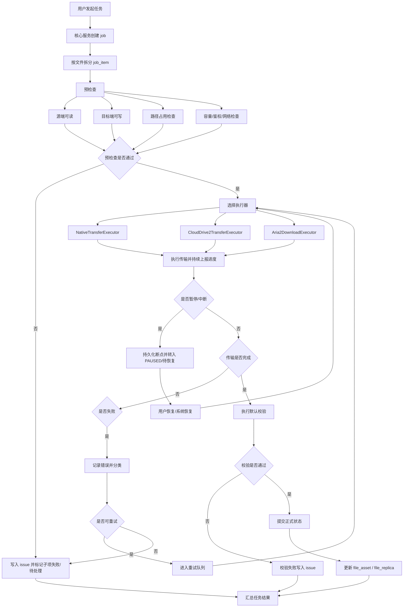
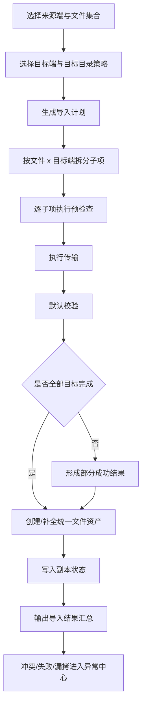
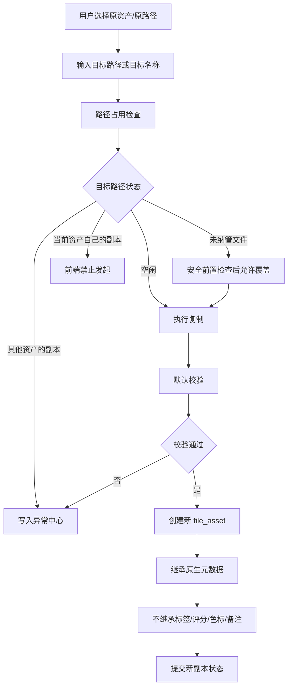
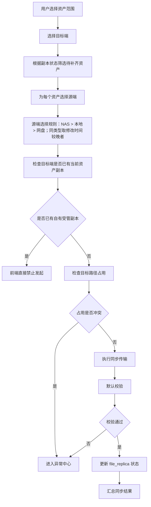
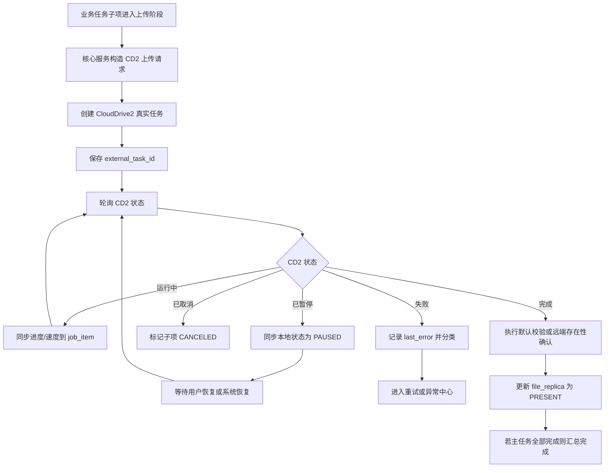
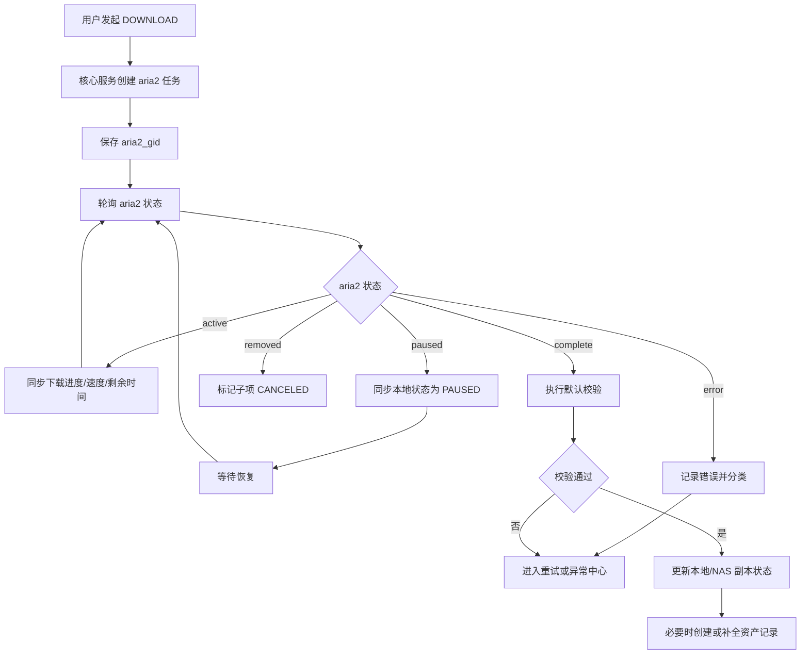
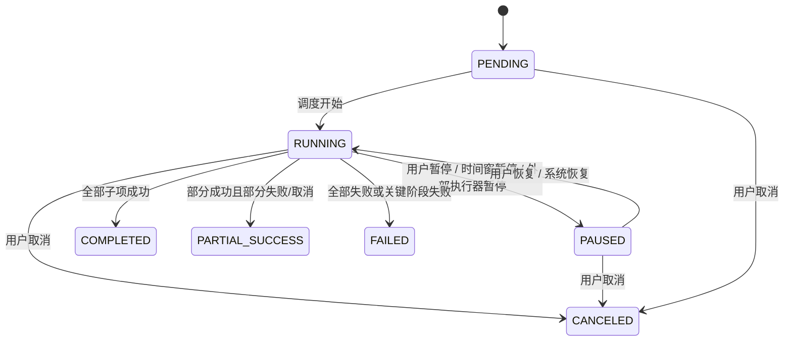
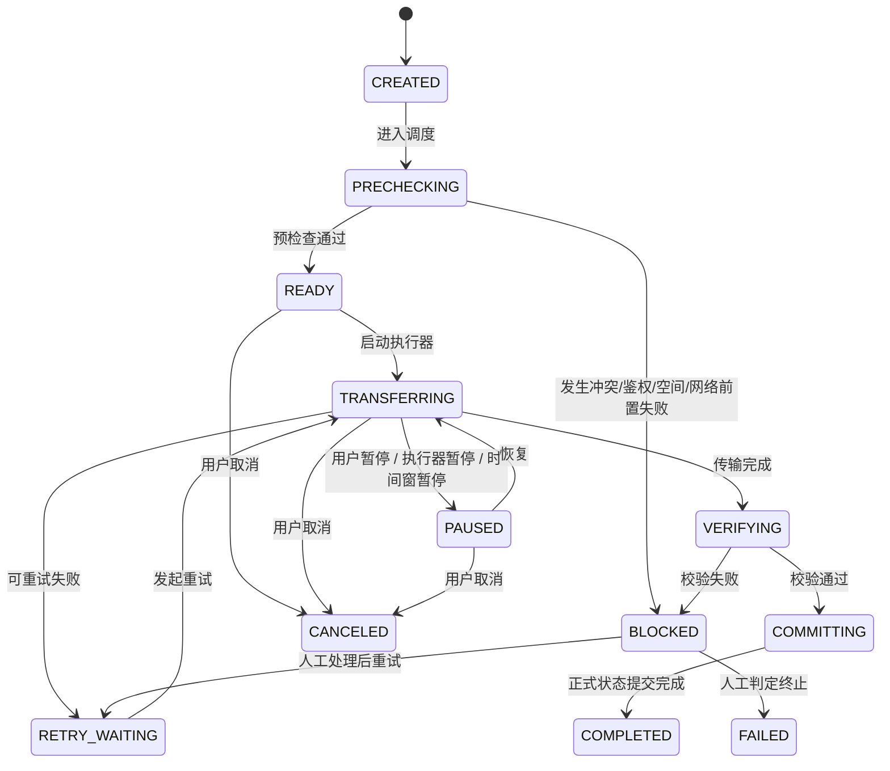
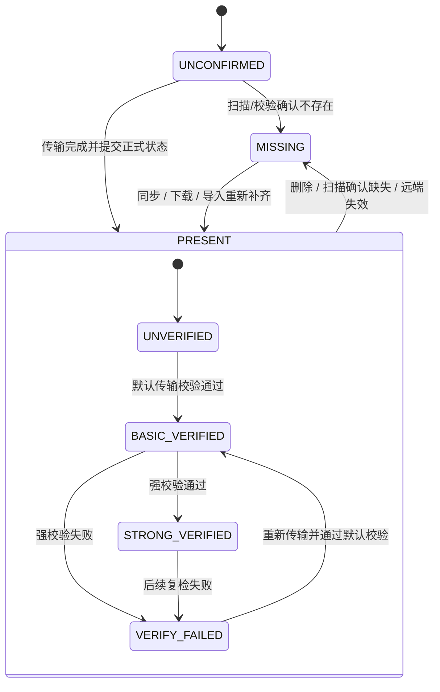
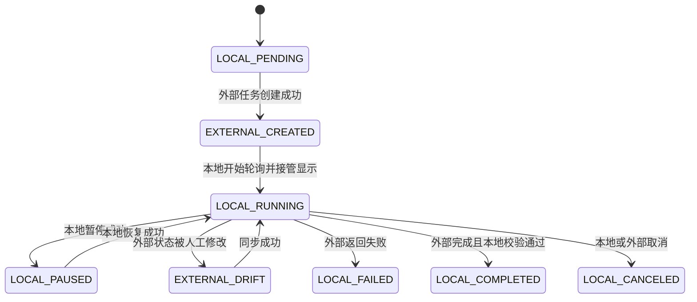

# 统一文件管理系统传输任务流程图与状态机设计

## 1. 文档目的

本文档基于以下两份既有文档，对统一文件管理系统中的传输任务进行进一步分析与设计：

- `docs/产品设计/统一文件管理系统-产品功能设计文档.md`
- `docs/技术架构/统一文件管理系统-技术架构设计文档.md`

本文档聚焦以下任务与链路：

- 本地与 NAS/SMB 之间的复制与同步
- 本地/NAS 与网盘之间的上传
- 网盘/远程资源到本地/NAS 的下载
- 导入任务的一对多分发链路

本文档不展开数据库 DDL 和接口字段细节，重点补足：

- 统一传输任务的业务边界
- 各类传输任务的共性流程
- 任务、子项、副本的状态机
- 外部执行器（CloudDrive2、aria2）与系统状态的映射关系
- 异常收敛和恢复入口

## 2. 基于既有文档的关键结论

### 2.1 已明确的一致性结论

- `IMPORT / COPY / SYNC / DOWNLOAD` 是不同业务任务，但需要在任务中心提供统一传输体验。
- 所有传输任务都必须支持断点续传、暂停、恢复、取消、重试与结果校验。
- 核心服务是唯一权威状态源，CloudDrive2 与 aria2 只是外部执行器，不是权威任务中心。
- 正式资产状态与任务过程状态必须分离，只有在传输完成并通过校验后，才更新正式状态。
- 冲突、路径占用、校验失败、鉴权失败、网络异常、空间不足等问题统一进入异常中心。
- 后续若核心迁移到 NAS，Windows 本地链路中的设备感知、本地读写、扫描与校验可由 `Local Edge Agent` 执行，但任务状态与正式写账仍只由 `Central Core` 统一提交。

### 2.2 任务语义边界

| 任务 | 输入语义 | 输出语义 | 是否生成新资产 |
| --- | --- | --- | --- |
| 导入 `IMPORT` | 外部来源端进入资产库 | 分发到一个或多个目标端并纳入统一资产表 | 是 |
| 复制 `COPY` | 一个相对路径复制到另一个相对路径/名称 | 形成新的文件资产 | 是 |
| 同步 `SYNC` | 已有资产在不同端点间补齐副本 | 更新副本状态 | 否 |
| 下载 `DOWNLOAD` | 远程可下载资源/云端文件拉取到受管端点 | 更新资产与副本状态 | 视入口而定 |

### 2.3 “上传”与“下载”的架构定位

- “上传”不是首版必须单独暴露的业务任务类型，而是 `IMPORT / COPY / SYNC` 在目标端为网盘时的一种执行形态。
- “下载”在首版是单独的业务任务类型，因为其执行器固定为 `aria2`，且输入语义是远程资源拉取。
- 因此，流程图中需要区分“业务任务类型”和“实际传输执行器”两层。

### 2.4 删除相关约束

- 删除逻辑以技术架构设计文档为准：删除后若所有副本都不存在，则资产进入逻辑删除状态，并等待后台清理。
- 当前客户端文件中心原型额外体现为：从指定端点删除最后一个受管副本后，资产会直接从当前列表中移除；“删除资产”操作仍保留 `PENDING_DELETE` 语义。

本设计文档仅覆盖传输任务，不扩展删除回滚语义；涉及任务取消后的状态回退时，以“不中断正式状态，仅回滚过程状态和中间产物”为原则。

### 2.5 当前客户端入口对齐

当前客户端中，与传输任务直接相关的入口主要已经落在“文件中心”页面：

- 单文件 / 单目录同步：行内端点状态按钮，或“更多操作 -> 同步 -> 指定端点”
- 批量同步：选择工具条中的“同步 -> 指定端点”
- 单文件 / 单目录删除副本：行内“更多操作 -> 删除 -> 指定端点”
- 批量删除副本：选择工具条中的“删除副本 -> 指定端点”
- 上传文件 / 上传文件夹：文件中心工具条中的“上传”

因此，传输任务在当前客户端的交互入口并不是独立的“同步中心工作台”，而是以文件中心为主要发起面。

### 2.6 当前客户端原型对齐

当前客户端原型中，传输任务与文件数据已经打通，并且任务中心已按实际实现做了展示对齐：

- 一级任务使用 `fileNodeIds`，二级任务使用 `fileNodeId`；名称、路径、大小优先从 `fileNodes` 实时解析，导入或未入库场景再兜底旧字段。
- 文件夹型任务展开时，二级项按递归文件展开，不再展示文件夹节点本身。
- 删除文件前会先检查关联的运行中传输任务；若存在冲突，当前原型会提示，并支持跳转查看任务或取消任务后再删除。
- 客户端启动时会用最新任务 mock 覆盖任务相关持久化状态，保证任务中心展示与当前原型数据一致。
- 状态筛选已新增“活跃中”默认项。
- 任务行动作遵循互斥规则：暂停 / 继续 / 重试三者互斥渲染；已完成任务显示“完成”占位按钮。
- 已删除关联文件的任务子项会进入失效展示态，表现为文件已删除、删除线样式且整行不可点击。
- 当前客户端已落地“异常徽标 + 异常浮窗 + 跳转异常中心”链路：点击任务异常徽标可查看当前任务关联异常，点击单条异常可聚焦到异常中心对应记录，点击“查看全部异常/处置所有异常”可按 `taskId + sourceDomain` 聚焦异常中心。
- 当前客户端也已落地反向回查：从异常中心打开任务中心时，可自动聚焦相关传输任务、展开对应上下文，并自动打开该任务的异常浮窗。

## 3. 统一传输模型

### 3.1 分层模型

统一传输任务分为四层：

1. 业务任务层：导入、复制、同步、下载
2. 任务编排层：任务创建、拆分子项、调度、恢复、结果汇总
3. 执行器层：本地/SMB 传输、CloudDrive2 上传、aria2 下载
4. 状态提交层：校验、正式写账、异常收敛、摘要更新

### 3.2 统一子项模型

无论是哪种任务，最终都应拆为可恢复的 `job_item` 传输子项，每个子项至少包含：

- 来源端点与来源路径
- 目标端点与目标路径
- 执行器类型
- 断点信息
- 外部任务映射信息
- 当前阶段
- 当前状态
- 错误信息

### 3.3 执行器选择规则

| 链路 | 执行器 | 说明 |
| --- | --- | --- |
| 本地 -> 本地 | `NativeTransferExecutor` | 支持断点续传、暂停、恢复 |
| 本地 -> NAS/SMB | `NativeTransferExecutor` | 统一走文件系统/SMB 适配 |
| NAS/SMB -> 本地 | `NativeTransferExecutor` | 同上 |
| 本地/NAS -> 网盘 | `CloudDrive2TransferExecutor` | 必须创建真实远程上传任务 |
| 网盘/远程资源 -> 本地/NAS | `Aria2DownloadExecutor` | 必须创建真实下载任务 |

补充约束：

- 当前阶段 `NativeTransferExecutor` 可由 Windows 本机核心服务直接执行。
- 后续若采用 `Central Core + Local Edge Agent` 架构，凡是涉及 Windows 本地磁盘、移动硬盘、U 盘等本地链路时，`NativeTransferExecutor` 的实际执行位置可下沉到 `Local Edge Agent`。
- 无论执行位置如何变化，任务进度、异常收敛、校验结果与最终副本状态都必须先回到 `Central Core`，再由其统一对外呈现。

## 4. 统一传输主流程图

## 5. 分任务流程设计

### 5.1 导入任务流程图

导入任务的关键点是“来源端进入资产库”与“一对多目标分发”。

设计说明：

- 一个来源文件可能对应多个目标端，因此导入任务天然是“一主任务、多目标子项”模型。
- 导入的资产创建时机建议放在“任务建单后、正式提交前”的受控阶段，避免边传输边污染正式资产状态。
- 若多目标中部分成功、部分失败，主任务应允许进入 `PARTIAL_SUCCESS`，但已成功的副本状态可以正式提交。

### 5.2 复制任务流程图

复制任务的关键点是“生成新资产”与“元数据继承策略”。

### 5.3 同步任务流程图

同步任务的关键点是“同一资产补齐副本，不生成新资产”。

### 5.4 上传执行流程图

上传是业务任务在“目标端为网盘”时的执行路径。

### 5.5 下载执行流程图

下载是“远程资源/云端文件 -> 本地或 NAS”的统一拉取路径。

## 6. 状态机设计

### 6.1 主任务状态机

该状态机对应 `job.status`，与既有架构文档保持一致。

状态语义：

- `PENDING`：已建单，尚未开始调度
- `RUNNING`：至少一个子项正在执行或校验
- `PAUSED`：任务被用户、系统时间窗或外部执行器暂停
- `COMPLETED`：全部子项完成且达到提交条件
- `PARTIAL_SUCCESS`：存在可提交成功结果，同时有失败/取消/待处理子项
- `FAILED`：任务整体未形成可交付结果
- `CANCELED`：用户主动终止，不再继续

### 6.2 传输子项状态机

建议对 `job_item` 保留更细粒度的运行阶段，避免仅靠主任务状态表达全部传输过程。

建议最少补充两个字段：

- `job_item.status`：对齐主任务维度的粗状态
- `job_item.phase`：表达 `PRECHECKING / TRANSFERRING / VERIFYING / COMMITTING` 等细阶段

### 6.3 副本状态机

该状态机对应 `file_replica.state` 与 `verify_state` 的组合语义。

设计说明：

- `file_replica.state` 只表达“是否存在”。
- `verify_state` 只表达“存在的可信度”。
- 这样可以避免把“校验失败”与“文件不存在”混成一个状态。

### 6.4 外部执行器映射状态机

该状态机用于描述“本地任务状态”与“外部执行器状态”的同步关系。

设计重点：

- CloudDrive2 与 aria2 的状态变化必须回写本地任务中心。
- 外部执行器状态只作为事实输入，不直接替代本地权威状态。
- 若出现“外部已完成，但本地未校验”场景，本地仍应保持在 `VERIFYING` 或等价阶段，而不是直接 `COMPLETED`。

## 7. 异常与恢复设计

### 7.1 异常分类

传输任务至少收敛以下异常：

- 路径占用冲突
- 未纳管文件覆盖风险
- 当前资产自身副本重复同步
- 其他资产副本冲突
- 网络中断
- 鉴权失效
- 空间不足
- 校验失败
- 外部任务丢失或状态漂移

### 7.2 统一恢复入口

所有失败或待处理的子项都应进入以下之一：

- 自动重试队列
- 人工处理异常中心
- 可恢复暂停状态

恢复动作统一为：

1. 重新完成前置检查
2. 重新关联断点或外部任务
3. 从最近可恢复阶段继续，而不是从头开始

当前客户端原型对这条规则的 UI 对齐为：

- 人工恢复入口统一收敛到异常中心，而不是分散在任务列表的主操作区里。
- 异常中心跳回任务中心时，会携带 `taskIds / issueId / taskItemId / openIssuePopover`，保证用户能直接回到待恢复任务与相关异常上下文。
- 当前任务与异常的关联口径同时支持 `issue.taskId` 与 `task.issueIds[]`，为后续后端聚合输出保留兼容空间。

## 8. 设计建议与补充约束

### 8.1 建议新增的运行时概念

为避免流程图落地时只有粗状态、不足以支撑 UI 与恢复逻辑，建议补充：

- `job_item.phase`
- `job_item.resume_token` 或等价断点信息
- `job_item.retry_count`
- `job_item.last_checkpoint_at`
- `job_item.issue_id`

### 8.2 统一提交原则

所有传输任务必须遵循以下提交顺序：

1. 传输完成
2. 默认校验完成
3. 正式写入 `file_asset / file_replica`
4. 更新摘要状态
5. 输出任务汇总

禁止：

- 传输未完成时提前将副本标记为 `PRESENT`
- 外部执行器显示完成即直接视为业务完成
- 边传输边写正式资产状态

### 8.3 统一前置检查原则

所有传输任务在执行前都应统一检查：

- 来源端可读性
- 目标端可写性
- 路径占用类型
- 目标容量
- 鉴权状态
- 网络可达性
- 执行器可用性

### 8.4 后续 NAS 部署演进补充

- 当 `Central Core` 部署在 NAS 上时，不应直接把 Windows 本地 USB / 移动硬盘视为 NAS 可直接扫描和执行的源端。
- 若传输链路涉及 Windows 本地设备或本地目录，设备感知、前置检查中的本地可读写校验、实际读写动作与本地校验可由 `Local Edge Agent` 执行。
- `Local Edge Agent` 需要持续回传事实、进度、错误与结果，但不作为任务权威中心。
- `Central Core` 继续统一生成 `job / job_item / issue`，并负责状态汇总、结果提交与对外查询。
- 因此，传输状态机本身不需要因为部署位置变化而改写，只需要在执行器落地层增加“中央编排、边缘执行”的实现分层。

## 9. 推荐落地顺序

1. 先落地主任务状态机、子项状态机与统一进度模型。
2. 再落地 `NativeTransferExecutor`，先打通本地与 NAS/SMB 传输。
3. 再接入 CloudDrive2 上传映射，补齐上传任务控制与状态同步。
4. 再接入 aria2 下载映射，补齐下载任务控制与断点恢复。
5. 最后补齐强校验、夜间时间窗与更细粒度异常治理。

## 10. 结论

围绕既有产品与架构文档，可以将各种传输任务统一收敛为“业务任务 + 传输子项 + 执行器 + 校验提交”的四段式模型。

其中：

- 导入与复制关注“是否生成新资产”
- 同步关注“是否补齐已有资产副本”
- 上传与下载关注“由哪个外部执行器承载真实传输过程”

在此基础上，统一任务状态机、统一子项阶段机、统一副本状态机，再配合异常中心和断点恢复机制，可以覆盖本地、NAS、网盘之间的大多数首版传输场景。后续若核心迁移到 NAS，也应保持这套状态机不变，只把 Windows 本地链路的执行下沉给 `Local Edge Agent`，并继续由 `Central Core` 作为唯一权威状态源。
