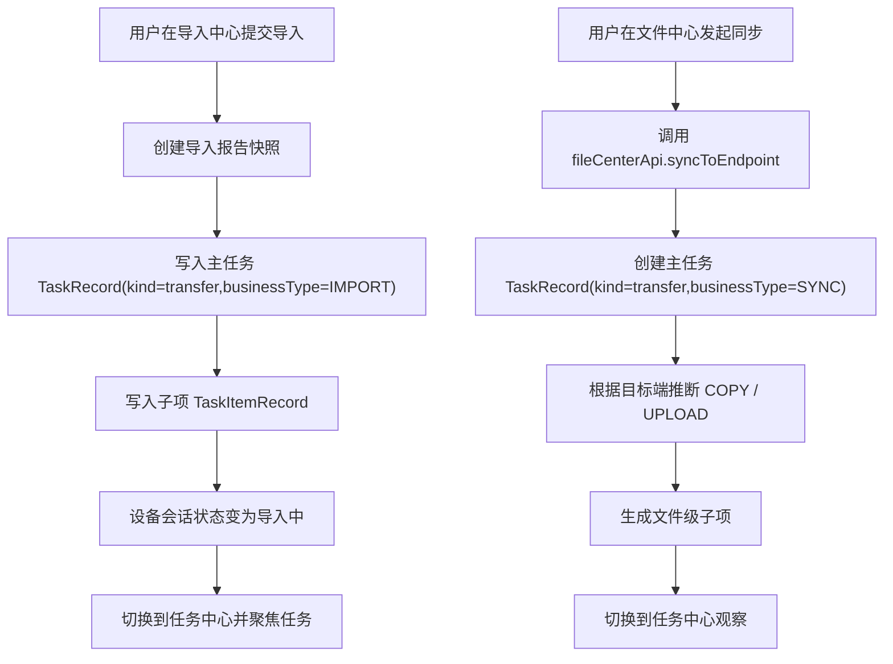
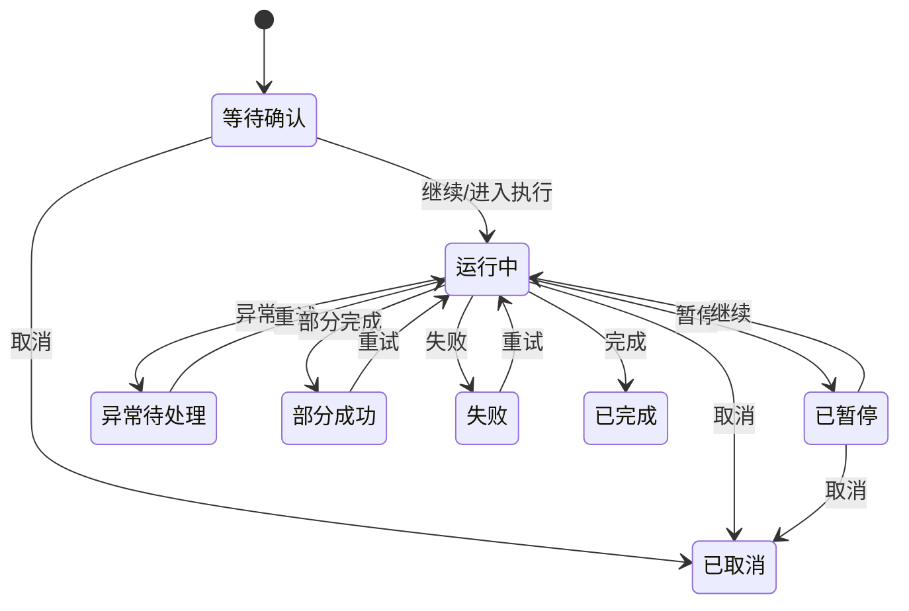
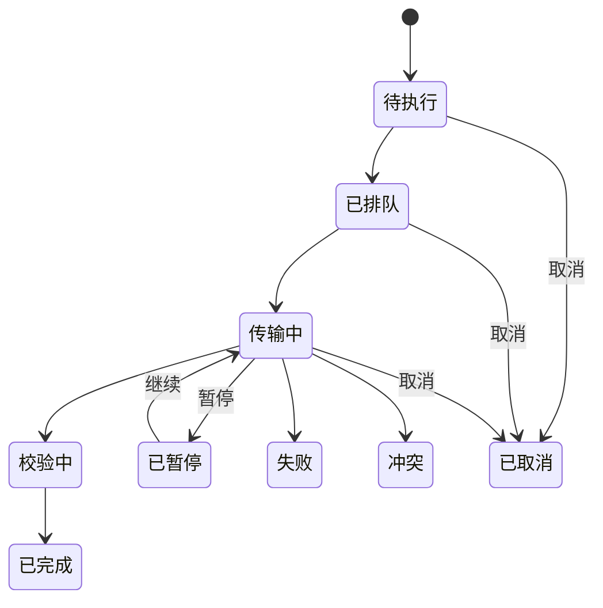

# 统一文件管理系统传输任务流程图与状态机设计

## 文档说明

- 更新时间：2026-04-08
- 对照代码：`client/src/App.tsx`、`client/src/pages/TaskCenterPage.tsx`、`client/src/data.ts`
- 范围：仅描述当前客户端实际实现的任务流转，不描述未来执行器架构

## 1. 当前任务体系结论

当前客户端中的“任务”并不全部来自真实后端，而是由本地状态驱动，来源主要有三类：

1. `data.ts` 里的种子任务
2. 文件中心操作即时生成的任务
3. 导入中心提交时即时生成的任务

其中与“传输”直接相关的真实入口只有两类：

- 导入中心提交导入
- 文件中心同步到端点

删除动作虽然会进入任务中心，但会落成“其他任务 / 删除清理”，不属于传输任务。

## 2. 当前传输任务来源

### 2.1 导入中心提交

触发位置：

- `App.tsx` 中 `ImportCenterPage` 的 `onSubmitImport`

当前行为：

- 校验当前设备会话是否存在
- 校验所有未跳过文件是否已选择目标端
- 生成导入报告快照
- 把设备会话状态改为“导入中”
- 把导入草稿状态改为“导入中”
- 生成一条 `kind = transfer`、`businessType = IMPORT` 的主任务
- 为源文件生成子项记录
- 切换到任务中心并聚焦该任务

### 2.2 文件中心同步

触发位置：

- 单项端点状态按钮
- 行内“更多操作 -> 同步”
- 批量操作中的“同步”

当前行为：

- 调用 `fileCenterApi.syncToEndpoint`
- 为每个选中对象生成一条 `kind = transfer`、`businessType = SYNC` 的主任务
- 根据目标端名称推断 `syncLinkType`
- 为每个文件或目录展开出的文件子项生成任务子项

## 3. 当前删除相关任务来源

删除不是传输任务，但和任务中心关系很强，因此单独列出：

### 3.1 删除资产

- 文件中心删除资产后，生成 `kind = other`
- `type = DELETE`
- `target = ASSET_CLEANUP`
- 状态初始为“等待清理”

### 3.2 删除端点副本

- 文件中心删除端点副本后，生成 `kind = other`
- `type = DELETE`
- `target = 指定端点`
- 状态初始为“已提交”

## 4. 当前传输主流程

## 5. 当前主任务状态机

当前代码中主任务状态由 `applyTaskStatusChange()` 和种子数据共同驱动。实际会出现的主状态包括：

- 等待确认
- 运行中
- 已暂停
- 异常待处理
- 部分成功
- 失败
- 已完成
- 已取消

对应的主动作包括：

- 暂停
- 继续
- 重试
- 取消

### 5.1 状态动作映射

- 暂停：把主任务状态改为“已暂停”，速度变为 `—`，剩余时间显示“等待继续”
- 继续：把状态改为“运行中”
- 重试：把状态改为“运行中”，并在部分逻辑下重新计算待处理总量
- 取消：把状态改为“已取消”，并对传输任务做待处理体量扣减

## 6. 当前任务子项状态机

当前客户端中，子项状态来源有两类：

1. 任务中心种子数据中的既有状态
2. 本地动作函数对状态的即时修改

常见子项状态包括：

- 待执行
- 已排队
- 传输中
- 校验中
- 已暂停
- 已完成
- 失败
- 冲突
- 已取消
- 已跳过

## 7. 当前导入任务的特殊口径

导入中心提交后生成的主任务当前具有以下固定特征：

- `kind = transfer`
- `type = IMPORT`
- `businessType = IMPORT`
- 初始状态是“等待确认”
- `source` 为设备挂载路径
- `target` 为目标端标签的拼接结果
- 子项初始 `status = 已排队`
- 子项初始 `phase = 待执行`

当前没有真正的执行器接管逻辑，所以“等待确认 -> 运行中 -> 已完成”的变化仍依赖本地 mock 和用户动作。

## 8. 当前同步任务的特殊口径

文件中心创建的同步任务具有以下特征：

- `kind = transfer`
- `type = SYNC`
- `businessType = SYNC`
- 初始状态是“等待确认”
- `source = 统一资产`
- `target = 目标端名称`
- `syncLinkType` 由目标端名称推断：
  - 包含 `115` 或 `云` 倾向 `UPLOAD`
  - 其他默认 `COPY`

当前虽然种子数据中存在 `DOWNLOAD` 任务，但文件中心即时生成的同步任务不会自动创建 `DOWNLOAD`。

## 9. 当前任务与其它模块的联动

### 9.1 与异常中心联动

- 任务列表中如果有关联异常，会出现异常数量徽标
- 点击异常徽标可打开任务异常浮窗
- 可以从浮窗跳转到异常中心

### 9.2 与文件中心联动

- 任务详情支持跳回文件中心
- 回跳时会计算对应目录与选中项，并自动切换资产库 / 目录 / 高亮对象

### 9.3 与存储节点联动

- 其他任务中的扫描类任务，详情页按钮会跳到存储节点

## 10. 当前实现的边界与限制

以下内容当前必须按“未实现”理解：

- 真实执行器调度
- 真实断点续传
- 真实任务持久化
- 真实上传 / 下载引擎
- 真实任务事件流推送

当前任务系统的价值在于验证：

- 主任务 / 子项的 UI 结构
- 状态切换规则
- 跨页面跳转关系
- 删除、同步、导入这三类入口如何进入统一任务中心

## 11. 当前版本结论

截至 2026-04-08，客户端已经形成了一套可运行的任务交互模型：

- 导入和同步进入统一的传输任务子页
- 删除清理进入其他任务子页
- 主任务与子项支持状态操作
- 任务可与异常中心、文件中心、存储节点联动

这套模型适合作为当前文档基线，但不能被描述成“已接入真实生产执行器”。
