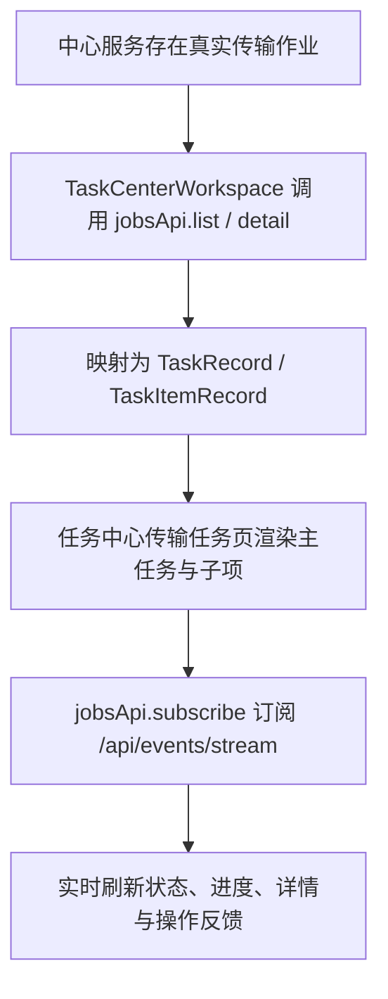

# 统一文件管理系统传输任务流程图与状态机设计

## 文档说明

- 更新时间：2026-04-11
- 对照代码：`client/src/pages/TaskCenterPage.tsx`、`client/src/pages/TaskCenterWorkspace.tsx`、`client/src/lib/jobsApi.ts`、`services/center/internal/jobs/*`
- 范围：仅描述当前仓库里与“传输任务”相关的真实实现状态，不把未接通的未来链路写成已完成

## 1. 当前结论

当前“传输任务”要分成两层理解：

1. 任务中心中的传输任务子页已经是一个真实作业消费页，正式数据源来自中心服务的 `jobs / job_items / job_events`
2. 传输 / 导入类真实上游创建链路还没有像扫描链路那样完全接通，因此当前环境里可稳定验证的真实任务仍主要是扫描类，不是传输类

这意味着：

- 传输任务页的展示、详情、主任务控制、子任务控制、SSE 实时刷新都已经按真实作业模型工作
- 但文档不能把当前仓库描述成“传输 / 导入生产链路已全部打通”

## 2. 当前正式数据源

传输任务子页当前正式读取：

- `jobsApi.list`
- `jobsApi.detail`
- `jobsApi.events`
- `jobsApi.subscribe`

对应后端接口：

- `GET /api/jobs`
- `GET /api/jobs/{id}`
- `GET /api/jobs/{id}/events`
- `POST /api/jobs/{id}/pause`
- `POST /api/jobs/{id}/resume`
- `POST /api/jobs/{id}/cancel`
- `POST /api/jobs/{id}/retry`
- `PATCH /api/jobs/{id}/priority`
- `POST /api/job-items/{id}/pause`
- `POST /api/job-items/{id}/resume`
- `POST /api/job-items/{id}/cancel`
- `GET /api/events/stream`

客户端由 `TaskCenterWorkspace` 负责把 `JobRecord` / `JobItemRecord` 映射为现有任务中心的展示模型，再交给 `TaskCenterPage` 渲染。

## 3. 当前真实流程

## 4. 当前状态模型

传输任务页展示的状态语义已经来自真实作业状态，而不是本地种子状态。当前客户端会把中心服务状态映射为以下中文语义：

- 主任务：待执行、运行中、已暂停、等待确认、部分成功、失败、已完成、已取消
- 子任务：待执行、运行中、已暂停、已跳过、失败、已完成、已取消

这些状态的真正权威来源是：

- 主任务：`jobs.status`
- 子任务：`job_items.status`
- 实时变化：`job_events` + `/api/events/stream`

## 5. 当前操作边界

### 5.1 主任务

当前已支持：

- 暂停
- 继续
- 取消
- 重试
- 改优先级

### 5.2 子任务

当前已支持：

- 暂停
- 继续
- 取消

当前未支持：

- 子任务级重试

## 6. 当前与其它模块的联动

### 6.1 与文件中心

- 任务详情支持跳回文件中心
- 这条链路已经属于真实任务中心消费层的一部分

### 6.2 与存储节点

- 扫描类其他任务详情支持跳回存储节点
- 该能力不属于传输任务主路径，但仍共用同一任务中心工作区

### 6.3 与异常中心

当前任务中心已不再保留正式的异常浮窗和异常中心跳转闭环。

- 详情中仍可展示异常摘要字段
- 异常相关能力当前仅保留接口化占位

## 7. 当前实现边界

以下内容当前仍不能写成已完成：

- 真实上传 / 下载执行链路的完整接通
- 真实断点续传
- 导入中心到真实传输作业的完整创建闭环
- 文件中心同步动作到真实传输作业的完整创建闭环
- 异常中心真实闭环

## 8. 当前版本结论

截至 2026-04-11，传输任务相关的真实能力已经推进到：

- 任务中心消费中心服务真实 `jobs / job_items / job_events`
- 主任务支持暂停、继续、取消、重试、改优先级
- 子任务支持暂停、继续、取消
- 通过 `/api/events/stream` 实时刷新

但当前应把它描述为“真实作业消费层已成立”，而不是“传输 / 导入生产链路已全部打通”。
