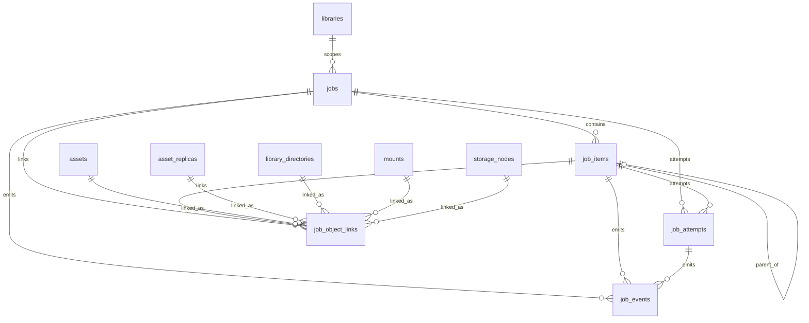

# 统一文件管理系统-任务域数据库设计

## 文档说明

- 更新时间：2026-04-08
- 适用范围：中心服务 PostgreSQL 主数据库中的任务域核心表
- 文档目标：冻结主任务、任务子项、执行尝试、事件流与任务关联对象的数据库设计口径，作为后续 SQL migration、Repository、Service 实现的直接依据
- 当前状态：已结合任务域冻结结论、资产域数据库设计、存储域数据库设计完成第一版可实施设计

## 1. 设计范围

本设计覆盖任务域核心 5 张表：

1. `jobs`
2. `job_items`
3. `job_attempts`
4. `job_events`
5. `job_object_links`

本设计会显式衔接以下已冻结表，但不重复展开其详细字段：

- `libraries`
- `assets`
- `asset_replicas`
- `library_directories`
- `storage_nodes`
- `mounts`

本设计暂不展开以下外围表，但会预留衔接边界：

- `issues`
- `issue_events`
- `import_device_sessions`
- `import_plans`
- `notifications`
- `worker_registrations`

## 2. 已冻结业务前提

### 2.1 任务模型前提

- 任务域使用统一主模型，不按“传输任务 / 其他任务”分表。
- 一次用户动作生成一个主任务。
- 多目标时按“文件或资产 x 目标挂载”拆任务子项。
- 重试不生成新主任务，保留任务 ID，产生新的 attempt。
- UI 也应支持子项独立重试。

### 2.2 执行语义前提

- “同步”定义为单向副本对齐，不是双向镜像同步。
- 传输内嵌校验属于传输子项阶段，不单独形成主任务。
- 独立校验任务用于归档后的定时或手动校验，属于独立主任务。
- 删除统一为删除类任务，细分为 `DELETE_REPLICA` 和 `DELETE_ASSET`。
- 扫描主任务按挂载建模，子项按目录或阶段展开。
- 单次连接测试默认不进主任务中心；批量连接测试或后台巡检进入任务域。

### 2.3 技术前提

- 主数据库为 PostgreSQL。
- 第一版字段类型优先采用 `text + check constraint`，不急于引入 PostgreSQL enum。
- 任务域必须和资产域、存储域保持单一事实源，不重复持有资产、副本、挂载的权威状态。
- 任务域需要支持后续扩展到异常、通知、导入、本地执行器注册，但当前不在本设计内展开这些表。

## 3. 总体设计原则

### 3.1 主任务、子项、尝试、事件分层

- `jobs` 表达用户可见的主任务。
- `job_items` 表达实际执行单元。
- `job_attempts` 表达某次执行尝试。
- `job_events` 表达状态变化、控制命令、执行回写和审计轨迹。

### 3.2 任务域不持有业务事实，只持有执行事实

- 资产当前状态仍以 `assets` / `asset_replicas` 为准。
- 目录当前状态仍以 `library_directories` / `directory_presences` 为准。
- 挂载当前状态仍以 `mounts` / `mount_runtime` 为准。
- 任务域只记录它想处理什么、处理到了什么程度、处理结果如何。

### 3.3 统一任务模型，多维度表达任务差异

- 任务家族用于 UI 视图分组。
- 任务意图用于业务语义区分。
- 执行链路用于表达 `COPY / UPLOAD / DOWNLOAD`。
- 执行单元类型用于表达子项粒度。

### 3.4 统一关联表，而不是为每类对象单独建一套任务关联表

本设计选择 `job_object_links`，而不是拆成 `job_asset_links`、`job_mount_links` 等多张表。

原因：

- 当前任务会同时关联资产、副本、目录、挂载、存储节点。
- 一次任务还会同时存在“源挂载”“目标挂载”“主体资产”“主体目录”等多种角色。
- 如果拆成多张表，后续查询“这个任务到底作用于哪些对象”会很散，扩展到导入会话或异常时还会继续加表。

代价：

- 关联表的约束设计更复杂。
- 需要通过检查约束保证“只关联一个对象类型”。

结论：

- 第一版接受这个复杂度，换取统一和扩展性。

## 4. 表清单与职责

### 4.1 `jobs`

职责：主任务表，表达一个可跟踪、可控制、可汇总的后台工作单元。

### 4.2 `job_items`

职责：任务子项表，表达主任务下的具体执行单元。

### 4.3 `job_attempts`

职责：执行尝试表，表达任务或子项的某次实际执行。

### 4.4 `job_events`

职责：任务事件表，表达状态变化、命令、执行回写和里程碑事件。

### 4.5 `job_object_links`

职责：任务关联对象表，表达主任务或子项与资产、副本、目录、挂载、存储节点之间的关系与角色。

## 5. 表设计

## 5.1 `jobs`

### 5.1.1 字段设计

| 字段名 | 类型 | 必填 | 默认值 | 说明 |
| --- | --- | --- | --- | --- |
| `id` | `uuid` | 是 | `gen_random_uuid()` | 主键 |
| `code` | `text` | 是 | 无 | 稳定任务标识，便于日志、跳转与外部引用 |
| `library_id` | `uuid` | 否 | `null` | 归属资产库，部分系统级任务可为空 |
| `job_family` | `text` | 是 | 无 | 任务家族，如 `TRANSFER` / `MAINTENANCE` |
| `job_intent` | `text` | 是 | 无 | 任务意图 |
| `route_type` | `text` | 否 | `null` | 执行链路类型，适用于传输类任务 |
| `status` | `text` | 是 | `'PENDING'` | 主任务状态 |
| `priority` | `text` | 是 | `'NORMAL'` | 优先级 |
| `title` | `text` | 是 | 无 | 任务标题 |
| `summary` | `text` | 否 | `null` | 任务摘要 |
| `source_domain` | `text` | 是 | 无 | 发起来源域，如文件中心、导入中心、存储节点、系统策略 |
| `source_ref_id` | `uuid` | 否 | `null` | 来源对象 ID，当前不做外键约束 |
| `source_snapshot` | `jsonb` | 否 | `null` | 来源上下文快照 |
| `progress_percent` | `numeric(5,2)` | 是 | `0` | 总进度，0-100 |
| `speed_bps` | `bigint` | 否 | `null` | 当前速度，字节每秒 |
| `eta_seconds` | `integer` | 否 | `null` | 预计剩余秒数 |
| `total_items` | `integer` | 是 | `0` | 子项总数 |
| `success_items` | `integer` | 是 | `0` | 成功子项数 |
| `failed_items` | `integer` | 是 | `0` | 失败子项数 |
| `skipped_items` | `integer` | 是 | `0` | 跳过子项数 |
| `issue_count` | `integer` | 是 | `0` | 关联异常数快照 |
| `latest_error_code` | `text` | 否 | `null` | 最近错误码 |
| `latest_error_message` | `text` | 否 | `null` | 最近错误摘要 |
| `outcome_summary` | `text` | 否 | `null` | 结果摘要文案 |
| `created_by_type` | `text` | 是 | 无 | 创建主体类型，如 `USER` / `SYSTEM` / `AGENT` |
| `created_by_ref` | `text` | 否 | `null` | 创建主体引用 |
| `created_at` | `timestamptz` | 是 | `now()` | 创建时间 |
| `started_at` | `timestamptz` | 否 | `null` | 开始时间 |
| `finished_at` | `timestamptz` | 否 | `null` | 结束时间 |
| `canceled_at` | `timestamptz` | 否 | `null` | 取消时间 |
| `updated_at` | `timestamptz` | 是 | `now()` | 更新时间 |

### 5.1.2 约束设计

- 主键：`pk_jobs (id)`
- 外键：
  - `fk_jobs_library_id -> libraries(id)`
- 唯一约束：
  - `ux_jobs_code (code)`
- 检查约束：
  - `job_family in ('TRANSFER', 'MAINTENANCE')`
  - `job_intent in ('IMPORT', 'REPLICATE', 'DELETE_REPLICA', 'DELETE_ASSET', 'SCAN_DIRECTORY', 'VERIFY_REPLICA', 'VERIFY_ASSET', 'EXTRACT_METADATA', 'CONNECTION_TEST')`
  - `route_type is null or route_type in ('COPY', 'UPLOAD', 'DOWNLOAD')`
  - `status in ('PENDING', 'QUEUED', 'RUNNING', 'PAUSED', 'WAITING_CONFIRMATION', 'WAITING_RETRY', 'PARTIAL_SUCCESS', 'FAILED', 'COMPLETED', 'CANCELED')`
  - `priority in ('LOW', 'NORMAL', 'HIGH')`
  - `source_domain in ('FILE_CENTER', 'IMPORT_CENTER', 'STORAGE_NODES', 'SYSTEM_POLICY', 'ISSUE_CENTER', 'SCHEDULED')`
  - `created_by_type in ('USER', 'SYSTEM', 'AGENT')`
  - `progress_percent >= 0 and progress_percent <= 100`
  - `total_items >= 0 and success_items >= 0 and failed_items >= 0 and skipped_items >= 0 and issue_count >= 0`

### 5.1.3 索引建议

- `ux_jobs_code(code)`
- `idx_jobs_library_status(library_id, status)`
- `idx_jobs_family_status(job_family, status)`
- `idx_jobs_intent_status(job_intent, status)`
- `idx_jobs_priority_status(priority, status)`
- `idx_jobs_created_at(created_at desc)`
- `idx_jobs_updated_at(updated_at desc)`
- `idx_jobs_source_domain(source_domain, created_at desc)`

### 5.1.4 设计说明

- `source_snapshot` 值得保留。导入、扫描、删除确认等入口上下文非常重要，但当前不宜强耦合到尚未设计的导入域表。
- `outcome_summary` 也值得保留。它是任务中心和通知中心的直接展示字段，不应每次都由事件流重新计算。
- `issue_count` 是快照字段，不是异常域权威事实，最终仍以异常域关联为准。

## 5.2 `job_items`

### 5.2.1 字段设计

| 字段名 | 类型 | 必填 | 默认值 | 说明 |
| --- | --- | --- | --- | --- |
| `id` | `uuid` | 是 | `gen_random_uuid()` | 主键 |
| `job_id` | `uuid` | 是 | 无 | 所属主任务 |
| `parent_item_id` | `uuid` | 否 | `null` | 父子项，用于目录扫描或分组步骤 |
| `item_key` | `text` | 是 | 无 | 子项稳定键，同一任务内唯一 |
| `item_type` | `text` | 是 | 无 | 执行单元类型 |
| `route_type` | `text` | 否 | `null` | 子项实际执行链路 |
| `status` | `text` | 是 | `'PENDING'` | 子项状态 |
| `phase` | `text` | 否 | `null` | 当前阶段，如传输中、校验中、清理中 |
| `title` | `text` | 是 | 无 | 子项标题 |
| `summary` | `text` | 否 | `null` | 子项摘要 |
| `source_path` | `text` | 否 | `null` | 源路径快照 |
| `target_path` | `text` | 否 | `null` | 目标路径快照 |
| `progress_percent` | `numeric(5,2)` | 是 | `0` | 子项进度 |
| `speed_bps` | `bigint` | 否 | `null` | 子项速度 |
| `eta_seconds` | `integer` | 否 | `null` | 子项预计剩余时间 |
| `bytes_total` | `bigint` | 否 | `null` | 总字节数 |
| `bytes_done` | `bigint` | 否 | `null` | 已完成字节数 |
| `attempt_count` | `integer` | 是 | `0` | 已产生的尝试次数快照 |
| `issue_count` | `integer` | 是 | `0` | 关联异常数快照 |
| `latest_error_code` | `text` | 否 | `null` | 最近错误码 |
| `latest_error_message` | `text` | 否 | `null` | 最近错误摘要 |
| `result_summary` | `text` | 否 | `null` | 子项结果摘要 |
| `started_at` | `timestamptz` | 否 | `null` | 开始时间 |
| `finished_at` | `timestamptz` | 否 | `null` | 结束时间 |
| `canceled_at` | `timestamptz` | 否 | `null` | 取消时间 |
| `updated_at` | `timestamptz` | 是 | `now()` | 更新时间 |
| `created_at` | `timestamptz` | 是 | `now()` | 创建时间 |

### 5.2.2 约束设计

- 主键：`pk_job_items (id)`
- 外键：
  - `fk_job_items_job_id -> jobs(id)`
  - `fk_job_items_parent_item_id -> job_items(id)`
- 唯一约束：
  - `ux_job_items_job_item_key (job_id, item_key)`
- 检查约束：
  - `item_type in ('ASSET_REPLICA_TRANSFER', 'DIRECTORY_SCAN', 'REPLICA_VERIFY', 'ASSET_METADATA_EXTRACT', 'REPLICA_DELETE', 'ASSET_DELETE_STEP', 'CONNECTIVITY_CHECK')`
  - `route_type is null or route_type in ('COPY', 'UPLOAD', 'DOWNLOAD')`
  - `status in ('PENDING', 'QUEUED', 'RUNNING', 'PAUSED', 'WAITING_CONFIRMATION', 'WAITING_RETRY', 'SKIPPED', 'FAILED', 'COMPLETED', 'CANCELED')`
  - `progress_percent >= 0 and progress_percent <= 100`
  - `bytes_total is null or bytes_total >= 0`
  - `bytes_done is null or bytes_done >= 0`
  - `attempt_count >= 0 and issue_count >= 0`

### 5.2.3 索引建议

- `ux_job_items_job_item_key(job_id, item_key)`
- `idx_job_items_job_status(job_id, status)`
- `idx_job_items_job_type(job_id, item_type)`
- `idx_job_items_parent(parent_item_id)`
- `idx_job_items_updated(updated_at desc)`

### 5.2.4 设计说明

- `item_key` 必须存在。后续重复提交、补建子项、断点恢复、对子项重试时都需要稳定键。
- `source_path` / `target_path` 是快照字段，不是权威路径事实。真正的权威对象仍然通过 `job_object_links` 指向资产、副本或挂载。
- `attempt_count` 和 `issue_count` 仍然是快照字段，换取列表和详情页的快速查询。

## 5.3 `job_attempts`

### 5.3.1 字段设计

| 字段名 | 类型 | 必填 | 默认值 | 说明 |
| --- | --- | --- | --- | --- |
| `id` | `uuid` | 是 | `gen_random_uuid()` | 主键 |
| `job_id` | `uuid` | 是 | 无 | 所属主任务 |
| `job_item_id` | `uuid` | 否 | `null` | 所属子项；为空表示主任务级尝试 |
| `attempt_scope` | `text` | 是 | 无 | `JOB` 或 `ITEM` |
| `attempt_no` | `integer` | 是 | 无 | 第几次尝试，从 1 开始 |
| `executor_type` | `text` | 是 | 无 | 由谁执行 |
| `executor_ref` | `text` | 否 | `null` | 执行器引用，如 worker ID、CD2、aria2 |
| `route_type` | `text` | 否 | `null` | 本次尝试实际走的链路 |
| `status` | `text` | 是 | `'RUNNING'` | 本次尝试状态 |
| `trigger_reason` | `text` | 是 | 无 | 触发原因，如初次执行、手动重试、自动重试 |
| `retry_of_attempt_id` | `uuid` | 否 | `null` | 重试来源 attempt |
| `started_at` | `timestamptz` | 是 | `now()` | 开始时间 |
| `finished_at` | `timestamptz` | 否 | `null` | 结束时间 |
| `error_code` | `text` | 否 | `null` | 失败错误码 |
| `error_message` | `text` | 否 | `null` | 失败错误信息 |
| `stats_snapshot` | `jsonb` | 否 | `null` | 尝试级统计快照 |
| `created_at` | `timestamptz` | 是 | `now()` | 创建时间 |

### 5.3.2 约束设计

- 主键：`pk_job_attempts (id)`
- 外键：
  - `fk_job_attempts_job_id -> jobs(id)`
  - `fk_job_attempts_job_item_id -> job_items(id)`
  - `fk_job_attempts_retry_of_attempt_id -> job_attempts(id)`
- 唯一约束：
  - `ux_job_attempts_job_scope_no (job_id, attempt_scope, job_item_id, attempt_no)`
- 检查约束：
  - `attempt_scope in ('JOB', 'ITEM')`
  - `executor_type in ('CENTER', 'AGENT', 'CD2', 'ARIA2', 'MIXED')`
  - `route_type is null or route_type in ('COPY', 'UPLOAD', 'DOWNLOAD')`
  - `status in ('RUNNING', 'SUCCEEDED', 'FAILED', 'CANCELED', 'TIMED_OUT')`
  - `trigger_reason in ('INITIAL', 'MANUAL_RETRY', 'AUTO_RETRY', 'RESUME')`
  - `attempt_no > 0`

### 5.3.3 索引建议

- `ux_job_attempts_job_scope_no(job_id, attempt_scope, job_item_id, attempt_no)`
- `idx_job_attempts_job(job_id, started_at desc)`
- `idx_job_attempts_item(job_item_id, started_at desc)`
- `idx_job_attempts_status(status, started_at desc)`

### 5.3.4 设计说明

- `job_item_id` 允许为空。这样可以表达“主任务级尝试”，例如整批作业排队、整体重试、主任务级调度失败。
- `retry_of_attempt_id` 必须保留。否则后续重试链无法回放。
- `executor_ref` 用 `text`，不要过早强绑到 `worker_registrations`，因为 CD2 和 aria2 不是同一种注册模型。

## 5.4 `job_events`

### 5.4.1 字段设计

| 字段名 | 类型 | 必填 | 默认值 | 说明 |
| --- | --- | --- | --- | --- |
| `id` | `uuid` | 是 | `gen_random_uuid()` | 主键 |
| `job_id` | `uuid` | 是 | 无 | 所属主任务 |
| `job_item_id` | `uuid` | 否 | `null` | 所属子项 |
| `attempt_id` | `uuid` | 否 | `null` | 所属尝试 |
| `sequence_no` | `bigint` | 是 | 无 | 任务内单调递增序号 |
| `event_type` | `text` | 是 | 无 | 事件类型 |
| `event_level` | `text` | 是 | `'INFO'` | 事件级别 |
| `event_source_type` | `text` | 是 | 无 | 事件来源类型 |
| `event_source_ref` | `text` | 否 | `null` | 事件来源引用 |
| `message` | `text` | 否 | `null` | 人类可读摘要 |
| `payload` | `jsonb` | 否 | `null` | 结构化负载 |
| `created_at` | `timestamptz` | 是 | `now()` | 事件时间 |

### 5.4.2 约束设计

- 主键：`pk_job_events (id)`
- 外键：
  - `fk_job_events_job_id -> jobs(id)`
  - `fk_job_events_job_item_id -> job_items(id)`
  - `fk_job_events_attempt_id -> job_attempts(id)`
- 唯一约束：
  - `ux_job_events_job_seq (job_id, sequence_no)`
- 检查约束：
  - `event_level in ('DEBUG', 'INFO', 'WARNING', 'ERROR')`
  - `event_source_type in ('USER', 'SYSTEM', 'SCHEDULER', 'EXECUTOR', 'CENTER', 'AGENT', 'CD2', 'ARIA2')`
  - `sequence_no > 0`

### 5.4.3 索引建议

- `ux_job_events_job_seq(job_id, sequence_no)`
- `idx_job_events_job_created(job_id, created_at desc)`
- `idx_job_events_item(job_item_id, created_at desc)`
- `idx_job_events_attempt(attempt_id, created_at desc)`
- `idx_job_events_type(event_type, created_at desc)`

### 5.4.4 事件类型建议

建议第一版先按字符串 + 约定值使用：

- `JOB_CREATED`
- `JOB_QUEUED`
- `JOB_STARTED`
- `JOB_PAUSED`
- `JOB_RESUMED`
- `JOB_CANCELED`
- `JOB_COMPLETED`
- `JOB_FAILED`
- `ITEM_CREATED`
- `ITEM_STARTED`
- `ITEM_PROGRESS`
- `ITEM_COMPLETED`
- `ITEM_FAILED`
- `ATTEMPT_STARTED`
- `ATTEMPT_FAILED`
- `ATTEMPT_SUCCEEDED`
- `RETRY_SCHEDULED`
- `ISSUE_ATTACHED`
- `ISSUE_CLEARED`
- `CONTROL_COMMAND_ACCEPTED`
- `CONTROL_COMMAND_REJECTED`

### 5.4.5 设计说明

- `job_events` 是任务域审计轨迹基础，不能省。
- `message` 与 `payload` 同时保留。前者利于直接展示，后者利于系统处理。
- `sequence_no` 建议由应用层按任务内递增维护，不依赖数据库全局顺序。
- 当前任务中心已经通过 `TaskCenterWorkspace` 和 `jobsApi` 消费这套表结构，列表、详情、子项和 SSE 刷新都围绕 `jobs` / `job_items` / `job_events` 展开。
- `job_attempts` 与 `job_object_links` 继续作为作业回溯和对象关联能力的基础，异常域与通知域的完整闭环仍在继续。

## 5.5 `job_object_links`

### 5.5.1 设计结论

本设计选择 **一个统一的任务关联表 `job_object_links`**，而不是拆成 `job_asset_links`、`job_mount_links` 等多张表。

原因：

- 当前任务会同时关联资产、副本、目录、挂载、存储节点。
- 同一个任务还会同时存在“源挂载”“目标挂载”“主体资产”“主体目录”等多种角色。
- 统一关联表更适合表达“任务与对象的关系角色”，而不是只表达“任务引用了什么对象”。

### 5.5.2 字段设计

| 字段名 | 类型 | 必填 | 默认值 | 说明 |
| --- | --- | --- | --- | --- |
| `id` | `uuid` | 是 | `gen_random_uuid()` | 主键 |
| `job_id` | `uuid` | 是 | 无 | 所属主任务 |
| `job_item_id` | `uuid` | 否 | `null` | 所属子项；为空表示任务级关联 |
| `link_role` | `text` | 是 | 无 | 关联角色 |
| `object_type` | `text` | 是 | 无 | 对象类型 |
| `asset_id` | `uuid` | 否 | `null` | 资产引用 |
| `asset_replica_id` | `uuid` | 否 | `null` | 副本引用 |
| `directory_id` | `uuid` | 否 | `null` | 目录引用 |
| `mount_id` | `uuid` | 否 | `null` | 挂载引用 |
| `storage_node_id` | `uuid` | 否 | `null` | 存储节点引用 |
| `is_primary` | `boolean` | 是 | `false` | 是否主对象 |
| `created_at` | `timestamptz` | 是 | `now()` | 创建时间 |

### 5.5.3 约束设计

- 主键：`pk_job_object_links (id)`
- 外键：
  - `fk_job_object_links_job_id -> jobs(id)`
  - `fk_job_object_links_job_item_id -> job_items(id)`
  - `fk_job_object_links_asset_id -> assets(id)`
  - `fk_job_object_links_asset_replica_id -> asset_replicas(id)`
  - `fk_job_object_links_directory_id -> library_directories(id)`
  - `fk_job_object_links_mount_id -> mounts(id)`
  - `fk_job_object_links_storage_node_id -> storage_nodes(id)`
- 唯一约束建议：
  - `ux_job_object_links_job_item_role_object`  
    建议由 `(job_id, coalesce(job_item_id, '00000000-0000-0000-0000-000000000000'::uuid), link_role, object_type, coalesce(asset_id, '00000000-0000-0000-0000-000000000000'::uuid), coalesce(asset_replica_id, '00000000-0000-0000-0000-000000000000'::uuid), coalesce(directory_id, '00000000-0000-0000-0000-000000000000'::uuid), coalesce(mount_id, '00000000-0000-0000-0000-000000000000'::uuid), coalesce(storage_node_id, '00000000-0000-0000-0000-000000000000'::uuid))` 实现
- 检查约束：
  - `link_role in ('SUBJECT_ASSET', 'SUBJECT_REPLICA', 'SUBJECT_DIRECTORY', 'SOURCE_MOUNT', 'TARGET_MOUNT', 'RELATED_STORAGE_NODE')`
  - `object_type in ('ASSET', 'ASSET_REPLICA', 'DIRECTORY', 'MOUNT', 'STORAGE_NODE')`
  - 必须且只能有一个对象引用非空
  - `object_type = 'ASSET'` 时，只有 `asset_id` 非空
  - `object_type = 'ASSET_REPLICA'` 时，只有 `asset_replica_id` 非空
  - `object_type = 'DIRECTORY'` 时，只有 `directory_id` 非空
  - `object_type = 'MOUNT'` 时，只有 `mount_id` 非空
  - `object_type = 'STORAGE_NODE'` 时，只有 `storage_node_id` 非空

### 5.5.4 索引建议

- `idx_job_object_links_job(job_id)`
- `idx_job_object_links_item(job_item_id)`
- `idx_job_object_links_asset(asset_id)`
- `idx_job_object_links_replica(asset_replica_id)`
- `idx_job_object_links_directory(directory_id)`
- `idx_job_object_links_mount(mount_id)`
- `idx_job_object_links_storage_node(storage_node_id)`
- `idx_job_object_links_role(link_role, object_type)`

### 5.5.5 设计说明

- 这张表是任务域和资产域、存储域的真正桥梁。
- 它不仅解决“任务关联了哪些对象”，还解决“这些对象在任务中的角色是什么”。
- 这对以下场景非常关键：
  - 从任务回跳文件中心
  - 从任务回跳存储节点
  - 判断某个挂载上的哪些任务正在运行
  - 判断某个资产当前被哪些任务影响
  - 导入任务中的多源多目标表达

## 6. 表关系图谱

### 6.1 关系解释

- 一个 `job` 可以有多个 `job_items`
- 一个 `job` 可以有多个 `job_attempts`，也可以由子项各自产生 attempt
- 一个 `job` 和 `job_item` 都可以产生 `job_events`
- `job_object_links` 是任务域和资产域、存储域之间的统一关联桥
- `libraries` 直接挂到 `jobs`，表示任务的主归属资产库

## 7. 关键设计决策

1. 任务域统一建模，不按传输任务 / 其他任务分表。
2. 一次用户动作只生成一个主任务，真实执行粒度下沉到子项。
3. “同步”统一抽象为 `REPLICATE`，路由维度用 `COPY / UPLOAD / DOWNLOAD` 表达。
4. `job_items` 表达执行单元，不等于简单的“文件列表项”。
5. 重试不生成新主任务，统一通过 `job_attempts` 表达。
6. `job_events` 作为审计轨迹和状态回放基础，不能省略。
7. 主任务和子项都允许持有事件与 attempt，兼容主任务级调度失败和子项级执行失败。
8. 任务域只持有执行事实，不持有资产、副本、挂载的权威状态。
9. 任务关联采用统一表 `job_object_links`，不拆成多套弱关联表。
10. `jobs.source_snapshot` 与 `job_items.source_path / target_path` 采用快照字段，避免强依赖尚未设计完成的导入域与通知域。
11. 主任务直接引用 `library_id`，保证任务中心按资产库过滤时不需要依赖对象关联反推。

## 8. 建议重点审阅的 5 个点

1. 是否接受 `job_object_links` 作为统一关联表，而不是拆成 `job_asset_links` / `job_mount_links`
建议：接受。

2. 是否接受 `job_attempts` 同时支持主任务级和子项级尝试
建议：接受。

3. 是否接受 `jobs` 中保留 `source_snapshot`，而不急于强绑导入会话等外部表
建议：接受。

4. 是否接受 `job_items` 保留 `source_path` / `target_path` 快照字段
建议：接受。

5. 是否接受 `libraries` 直接挂到 `jobs`
建议：接受。这样任务中心按资产库过滤最直接。

## 9. 仍存在的 trade-off 与推荐方案

### 9.1 `job_object_links` 统一表 vs 多张关联表

- 方案 A：统一 `job_object_links`
- 方案 B：拆成 `job_asset_links`、`job_mount_links` 等多表

推荐：方案 A。当前任务对象类型和角色维度都较多，统一表更适合后续扩展。

### 9.2 `job_attempts` 是否只挂到 `job_items`

- 方案 A：attempt 只属于子项
- 方案 B：attempt 同时支持主任务级和子项级

推荐：方案 B。因为扫描调度失败、整批排队失败、主任务级恢复等场景不一定落在某个子项上。

### 9.3 `job_events` 是否只存结构化 `payload`

- 方案 A：只有 `payload`
- 方案 B：`message + payload`

推荐：方案 B。前者利于机器处理，后者利于直接展示。

### 9.4 `jobs` 是否直接存结果汇总字段

- 方案 A：全部从 `job_items` 聚合
- 方案 B：主任务保留快照字段

推荐：方案 B。任务中心列表和通知中心都需要高频读取汇总结果，纯实时聚合成本高。

## 10. 当前实现状态

截至 2026-04-11，这套任务域表已经不是纯设计稿：

- `jobs`、`job_items`、`job_events` 已经成为任务中心的真实数据来源
- 客户端通过 `TaskCenterWorkspace` 和 `jobsApi` 拉取列表、详情、事件与控制结果
- `/api/events/stream` 已用于任务状态实时刷新
- 异常相关仍保留接口化占位，尚未形成完整的生产闭环

## 11. 审阅结论

如果本稿通过，可以把这 5 张表视为任务域数据库设计的第一份冻结稿。

后续最自然的下一步有两个：

1. 基于本稿继续整理为可直接落地的 PostgreSQL migration 设计草案。
2. 继续补与这 5 张表强相关的外围表：
   - `issues`
   - `issue_events`
   - `import_device_sessions`
   - `import_plans`
   - `worker_registrations`

当前最推荐先进入 `issues` / `issue_events` 设计，因为任务域和异常域会直接双向关联。
