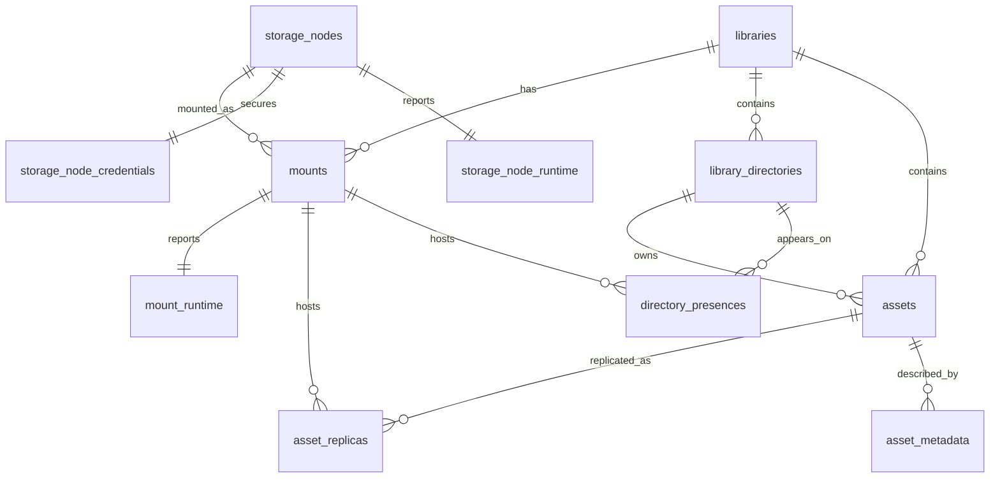

# 统一文件管理系统-存储域数据库设计

## 文档说明

- 更新时间：2026-04-08
- 适用范围：中心服务 PostgreSQL 主数据库中的存储域核心表
- 文档目标：冻结存储节点、挂载关系、节点凭据、节点运行态、挂载运行态的数据库设计口径，作为后续 SQL migration、Repository、Service 实现的直接依据
- 当前状态：已结合总体方案、资产域数据库设计与现有存储节点页面语义完成第一版可实施设计

## 1. 设计范围

本设计覆盖存储域核心 5 张表：

1. `storage_nodes`
2. `storage_node_credentials`
3. `storage_node_runtime`
4. `mounts`
5. `mount_runtime`

本设计会显式衔接以下资产域已冻结表，但不重复展开其详细字段：

- `libraries`
- `library_directories`
- `assets`
- `asset_replicas`
- `directory_presences`

本设计暂不展开以下外围表，但会预留关联关系：

- `mount_scan_histories`
- `jobs`
- `issues`
- `worker_registrations`

## 2. 已冻结业务前提

### 2.1 存储模型前提

- 存储节点本体和挂载关系必须拆开建模。
- 同一个存储节点可以以不同挂载方式接入不同资产库，或接入同一资产库的不同来源目录。
- 一个资产库只允许有一个逻辑根目录。
- 多个挂载进入同一个资产库时，必须共用同一套目录结构。
- `asset_replicas` 和 `directory_presences` 统一通过 `mount_id` 关联到具体挂载。

### 2.2 运行与接入前提

- 本地执行器负责本机直连资源相关任务。
- 中心服务统一调度，也可能直接处理 NAS / 115 相关任务。
- 115 网盘通过 CloudDrive2 + aria2 接入。
- 扫描发现文件缺失时，先记录副本或目录缺失事实，并生成异常提醒，不直接删除资产。

### 2.3 技术前提

- 主数据库为 PostgreSQL。
- 第一版字段类型优先采用 `text + check constraint`，不急于引入 PostgreSQL enum。
- 敏感凭据不得直接与主配置表混放。
- 高频变化的运行时状态应与静态配置分表保存。

## 3. 总体设计原则

### 3.1 节点本体与挂载关系分离

- `storage_nodes` 负责定义一个可管理的存储端本体。
- `mounts` 负责定义该存储端如何接入某个资产库。

### 3.2 静态配置与运行时状态分离

- 主配置表只保存相对稳定的配置事实。
- 连通性、鉴权状态、扫描状态、容量快照、最近错误等运行时事实单独保存在运行态表中。

### 3.3 敏感信息单独隔离

- 凭据、密码、Token、密钥引用不与 `storage_nodes` 主表混放。
- 第一版允许“本地加密密文”和“外部密钥引用”双模式并存。

### 3.4 存储域通过挂载桥接资产域

- 存储域与资产域的桥梁是 `mounts`。
- `asset_replicas` 和 `directory_presences` 不应直接依赖 `storage_nodes`，只应依赖 `mounts`。

## 4. 表清单与职责

### 4.1 `storage_nodes`

职责：定义可被系统识别和管理的存储端本体。

### 4.2 `storage_node_credentials`

职责：保存节点级敏感凭据或凭据引用。

### 4.3 `storage_node_runtime`

职责：保存节点级运行时状态，例如最近连通性、鉴权状态、最后错误、最近测试时间。

### 4.4 `mounts`

职责：表达某个存储节点以某种路径、目录、共享配置接入某个资产库的关系。

### 4.5 `mount_runtime`

职责：保存挂载级运行时状态，例如扫描状态、最近扫描时间、容量快照、下一次心跳时间、挂载级健康状态。

## 5. 表设计

## 5.1 `storage_nodes`

### 5.1.1 字段设计

| 字段名 | 类型 | 必填 | 默认值 | 说明 |
| --- | --- | --- | --- | --- |
| `id` | `uuid` | 是 | `gen_random_uuid()` | 主键 |
| `code` | `text` | 是 | 无 | 稳定业务标识 |
| `name` | `text` | 是 | 无 | 节点显示名称 |
| `node_type` | `text` | 是 | 无 | 节点类型 |
| `vendor` | `text` | 否 | `null` | 厂商或云盘类型，如 `115` |
| `address` | `text` | 否 | `null` | 节点地址、主机地址或设备标识 |
| `access_mode` | `text` | 是 | `'DIRECT'` | 接入方式 |
| `account_alias` | `text` | 否 | `null` | 展示用账号别名 |
| `enabled` | `boolean` | 是 | `true` | 是否启用 |
| `description` | `text` | 否 | `null` | 描述说明 |
| `created_at` | `timestamptz` | 是 | `now()` | 创建时间 |
| `updated_at` | `timestamptz` | 是 | `now()` | 更新时间 |
| `deleted_at` | `timestamptz` | 否 | `null` | 逻辑删除时间 |

### 5.1.2 约束设计

- 主键：`pk_storage_nodes (id)`
- 唯一约束：`ux_storage_nodes_code (code)`
- 检查约束：
  - `code <> ''`
  - `name <> ''`
  - `node_type in ('LOCAL', 'REMOVABLE', 'NAS', 'CLOUD')`
  - `access_mode in ('DIRECT', 'SMB', 'CD2')`

### 5.1.3 索引建议

- `ux_storage_nodes_code(code)`
- `idx_storage_nodes_type(node_type)`
- `idx_storage_nodes_vendor(vendor)`
- `idx_storage_nodes_enabled(enabled)`

### 5.1.4 字段口径

`node_type`：

- `LOCAL`
- `REMOVABLE`
- `NAS`
- `CLOUD`

`access_mode`：

- `DIRECT`
- `SMB`
- `CD2`

### 5.1.5 设计说明

- `vendor` 与 `node_type` 分开保存，不要把 `115` 直接塞进 `node_type`。
- `code` 应视为稳定业务标识，供日志、API、客户端缓存引用。
- `account_alias` 主要服务于 UI 展示和日志，不等于真实账号名。

## 5.2 `storage_node_credentials`

### 5.2.1 字段设计

| 字段名 | 类型 | 必填 | 默认值 | 说明 |
| --- | --- | --- | --- | --- |
| `id` | `uuid` | 是 | `gen_random_uuid()` | 主键 |
| `storage_node_id` | `uuid` | 是 | 无 | 所属存储节点 |
| `credential_kind` | `text` | 是 | 无 | 凭据类型 |
| `username` | `text` | 否 | `null` | 用户名 |
| `secret_ciphertext` | `text` | 否 | `null` | 密文 |
| `secret_ref` | `text` | 否 | `null` | 外部秘密引用 |
| `token_status` | `text` | 是 | `'UNKNOWN'` | Token 状态 |
| `expires_at` | `timestamptz` | 否 | `null` | 过期时间 |
| `updated_at` | `timestamptz` | 是 | `now()` | 更新时间 |
| `created_at` | `timestamptz` | 是 | `now()` | 创建时间 |

### 5.2.2 约束设计

- 主键：`pk_storage_node_credentials (id)`
- 外键：`fk_storage_node_credentials_storage_node_id -> storage_nodes(id)`
- 唯一约束：`ux_storage_node_credentials_node (storage_node_id)`
- 检查约束：
  - `credential_kind in ('NONE', 'USERNAME_PASSWORD', 'TOKEN')`
  - `token_status in ('UNKNOWN', 'VALID', 'EXPIRED', 'INVALID')`

### 5.2.3 索引建议

- `ux_storage_node_credentials_node(storage_node_id)`
- `idx_storage_node_credentials_token_status(token_status)`

### 5.2.4 设计说明

- 不要把账号密码、Token 直接放进 `storage_nodes`。
- 第一版同时保留 `secret_ciphertext` 和 `secret_ref`，便于开发期先本地加密存储，后续再切到系统密钥链或外部密钥服务。

## 5.3 `storage_node_runtime`

### 5.3.1 字段设计

| 字段名 | 类型 | 必填 | 默认值 | 说明 |
| --- | --- | --- | --- | --- |
| `id` | `uuid` | 是 | `gen_random_uuid()` | 主键 |
| `storage_node_id` | `uuid` | 是 | 无 | 所属存储节点 |
| `health_status` | `text` | 是 | `'UNKNOWN'` | 节点健康状态 |
| `auth_status` | `text` | 是 | `'UNKNOWN'` | 节点鉴权状态 |
| `last_check_at` | `timestamptz` | 否 | `null` | 最近检测时间 |
| `last_success_at` | `timestamptz` | 否 | `null` | 最近成功时间 |
| `last_error_code` | `text` | 否 | `null` | 最近错误码 |
| `last_error_message` | `text` | 否 | `null` | 最近错误信息 |
| `updated_at` | `timestamptz` | 是 | `now()` | 更新时间 |
| `created_at` | `timestamptz` | 是 | `now()` | 创建时间 |

### 5.3.2 约束设计

- 主键：`pk_storage_node_runtime (id)`
- 外键：`fk_storage_node_runtime_storage_node_id -> storage_nodes(id)`
- 唯一约束：`ux_storage_node_runtime_node (storage_node_id)`
- 检查约束：
  - `health_status in ('UNKNOWN', 'ONLINE', 'DEGRADED', 'OFFLINE', 'ERROR')`
  - `auth_status in ('UNKNOWN', 'AUTHORIZED', 'EXPIRED', 'FAILED', 'NOT_REQUIRED')`

### 5.3.3 索引建议

- `ux_storage_node_runtime_node(storage_node_id)`
- `idx_storage_node_runtime_health(health_status)`
- `idx_storage_node_runtime_auth(auth_status)`
- `idx_storage_node_runtime_last_check(last_check_at)`

### 5.3.4 设计说明

- `storage_nodes` 放静态配置，`storage_node_runtime` 放高频变化的运行时状态。
- 这样连接测试、健康巡检、CD2 鉴权回写不会频繁修改主表。

## 5.4 `mounts`

### 5.4.1 字段设计

| 字段名 | 类型 | 必填 | 默认值 | 说明 |
| --- | --- | --- | --- | --- |
| `id` | `uuid` | 是 | `gen_random_uuid()` | 主键 |
| `code` | `text` | 是 | 无 | 稳定挂载标识 |
| `library_id` | `uuid` | 是 | 无 | 所属资产库 |
| `storage_node_id` | `uuid` | 是 | 无 | 对应存储节点 |
| `name` | `text` | 是 | 无 | 挂载名称 |
| `mount_source_type` | `text` | 是 | 无 | 挂载来源类型 |
| `mount_mode` | `text` | 是 | `'READ_WRITE'` | 挂载模式 |
| `source_path` | `text` | 是 | 无 | 物理来源路径、共享目录或云端目录 |
| `relative_root_path` | `text` | 是 | `'/'` | 映入资产库逻辑根的相对起点 |
| `heartbeat_policy` | `text` | 是 | `'DAILY'` | 心跳周期策略 |
| `scan_policy` | `text` | 是 | `'MANUAL'` | 扫描策略 |
| `enabled` | `boolean` | 是 | `true` | 是否启用 |
| `sort_order` | `integer` | 是 | `0` | 排序值 |
| `created_at` | `timestamptz` | 是 | `now()` | 创建时间 |
| `updated_at` | `timestamptz` | 是 | `now()` | 更新时间 |
| `deleted_at` | `timestamptz` | 否 | `null` | 逻辑删除时间 |

### 5.4.2 约束设计

- 主键：`pk_mounts (id)`
- 外键：
  - `fk_mounts_library_id -> libraries(id)`
  - `fk_mounts_storage_node_id -> storage_nodes(id)`
- 唯一约束：
  - `ux_mounts_code (code)`
  - `ux_mounts_library_node_source (library_id, storage_node_id, source_path)`
- 检查约束：
  - `code <> ''`
  - `name <> ''`
  - `mount_source_type in ('LOCAL_PATH', 'NAS_SHARE', 'CLOUD_FOLDER')`
  - `mount_mode in ('READ_ONLY', 'READ_WRITE')`
  - `heartbeat_policy in ('NEVER', 'HOURLY', 'DAILY', 'WEEKLY')`
  - `scan_policy in ('MANUAL', 'ON_START', 'SCHEDULED')`
  - `source_path <> ''`
  - `relative_root_path <> ''`

### 5.4.3 索引建议

- `ux_mounts_code(code)`
- `ux_mounts_library_node_source(library_id, storage_node_id, source_path)`
- `idx_mounts_library(library_id)`
- `idx_mounts_storage_node(storage_node_id)`
- `idx_mounts_enabled(enabled)`
- `idx_mounts_library_enabled(library_id, enabled)`

### 5.4.4 字段口径

`mount_source_type`：

- `LOCAL_PATH`
- `NAS_SHARE`
- `CLOUD_FOLDER`

`mount_mode`：

- `READ_ONLY`
- `READ_WRITE`

`heartbeat_policy`：

- `NEVER`
- `HOURLY`
- `DAILY`
- `WEEKLY`

`scan_policy`：

- `MANUAL`
- `ON_START`
- `SCHEDULED`

### 5.4.5 设计说明

- `mounts` 是资产域和存储域的真正桥表。
- `asset_replicas` 和 `directory_presences` 只应依赖 `mount_id`，不要再直接依赖节点主表。
- `relative_root_path` 即使第一版大概率固定 `'/'` 也建议保留，它是后续支持子路径挂载的最低成本扩展点。

## 5.5 `mount_runtime`

### 5.5.1 字段设计

| 字段名 | 类型 | 必填 | 默认值 | 说明 |
| --- | --- | --- | --- | --- |
| `id` | `uuid` | 是 | `gen_random_uuid()` | 主键 |
| `mount_id` | `uuid` | 是 | 无 | 所属挂载 |
| `scan_status` | `text` | 是 | `'IDLE'` | 最近扫描状态 |
| `last_scan_at` | `timestamptz` | 否 | `null` | 最近扫描时间 |
| `last_scan_job_id` | `uuid` | 否 | `null` | 最近扫描任务 ID |
| `last_scan_summary` | `text` | 否 | `null` | 最近扫描摘要 |
| `next_heartbeat_at` | `timestamptz` | 否 | `null` | 下一次心跳时间 |
| `capacity_bytes` | `bigint` | 否 | `null` | 总容量 |
| `available_bytes` | `bigint` | 否 | `null` | 可用容量 |
| `auth_status` | `text` | 是 | `'UNKNOWN'` | 挂载级鉴权状态 |
| `health_status` | `text` | 是 | `'UNKNOWN'` | 挂载级健康状态 |
| `last_error_code` | `text` | 否 | `null` | 最近错误码 |
| `last_error_message` | `text` | 否 | `null` | 最近错误信息 |
| `updated_at` | `timestamptz` | 是 | `now()` | 更新时间 |
| `created_at` | `timestamptz` | 是 | `now()` | 创建时间 |

### 5.5.2 约束设计

- 主键：`pk_mount_runtime (id)`
- 外键：`fk_mount_runtime_mount_id -> mounts(id)`
- 唯一约束：`ux_mount_runtime_mount (mount_id)`
- 检查约束：
  - `scan_status in ('IDLE', 'RUNNING', 'SUCCESS', 'FAILED')`
  - `auth_status in ('UNKNOWN', 'AUTHORIZED', 'EXPIRED', 'FAILED', 'NOT_REQUIRED')`
  - `health_status in ('UNKNOWN', 'ONLINE', 'DEGRADED', 'OFFLINE', 'ERROR')`
  - `capacity_bytes is null or capacity_bytes >= 0`
  - `available_bytes is null or available_bytes >= 0`

### 5.5.3 索引建议

- `ux_mount_runtime_mount(mount_id)`
- `idx_mount_runtime_scan_status(scan_status)`
- `idx_mount_runtime_health(health_status)`
- `idx_mount_runtime_auth(auth_status)`
- `idx_mount_runtime_last_scan(last_scan_at)`

### 5.5.4 设计说明

- `mount_runtime` 主要服务于存储节点页、任务联动和后台巡检。
- 容量、鉴权状态、扫描状态更贴近挂载视角，而不是节点抽象视角。
- 扫描历史不应直接塞进本表，后续建议单独设计 `mount_scan_histories`。

## 6. 与资产域的关系图谱

### 6.1 关系说明

- `storage_nodes` 定义存储端本体。
- `mounts` 定义节点如何接入资产库。
- `asset_replicas` 和 `directory_presences` 统一通过 `mount_id` 连接到具体挂载。
- `libraries`、`library_directories`、`assets` 保留逻辑命名空间和逻辑路径。
- 存储域和资产域的桥梁就是 `mounts`。

## 7. 关键设计决策

1. 节点本体和挂载关系必须拆开建模。
2. `mounts` 是资产域和存储域的桥表。
3. 敏感凭据单独拆到 `storage_node_credentials`。
4. 运行时状态单独拆到 `storage_node_runtime` 和 `mount_runtime`。
5. `storage_nodes` 不直接绑定 `library_id`，节点本体不是某个资产库私有。
6. `mounts` 保留 `relative_root_path`，即使第一版默认 `'/'` 也不删。
7. 节点类型、厂商、接入方式三者分开，不混成单字段。
8. 挂载级状态和节点级状态分开。
9. `mount_runtime` 保留容量、扫描状态、鉴权状态，贴近现有产品页面语义。
10. 第一版全部使用 `text + check constraint`，不急于引入 PostgreSQL enum。
11. `storage_node_credentials` 保留 `secret_ciphertext` 和 `secret_ref` 双模式。
12. 扫描历史不进入主运行态表，后续独立设计。

## 8. 建议重点审阅的 5 个点

1. 是否接受“节点本体”和“挂载关系”拆成两层，而不是一张表。
建议：接受。

2. 是否接受拆出 `storage_node_credentials`。
建议：接受。

3. 是否接受拆出 `storage_node_runtime` 和 `mount_runtime`。
建议：接受。

4. `relative_root_path` 是否保留。
建议：接受，即使第一版默认 `'/'`，仍然值得作为未来扩展位保留。

5. `mount_runtime` 是否承载容量、扫描状态、鉴权状态。
建议：接受，这最贴近现有页面展示和运维语义。

## 9. 最小化设计方案与扩展型设计方案

### 9.1 方案 A：最小化设计

只建两张表：

- `storage_nodes`
- `mounts`

优点：

- migration 最简单
- 最快能开始写 repository

缺点：

- 凭据、运行态、静态配置全部混在主表中
- 后续一旦接入真实扫描、鉴权、CD2 状态回写，很快还会再拆表
- 不利于安全边界和运行态隔离

### 9.2 方案 B：扩展型设计

建五张表：

- `storage_nodes`
- `storage_node_credentials`
- `storage_node_runtime`
- `mounts`
- `mount_runtime`

优点：

- 静态配置、敏感凭据、运行状态边界清晰
- 更适合真实接入 NAS、115、扫描和心跳
- 和现有资产域、副本域衔接更干净

缺点：

- migration 和 repository 稍微复杂一些
- 前期会多几张表

### 9.3 推荐结论

推荐采用方案 B：扩展型设计。

原因不是为了过度设计，而是因为你这个项目的存储节点不是“配置页附属数据”，而是真正会参与：

- 扫描
- 心跳
- 鉴权
- 容量检查
- 任务执行归属
- 115 接入
- 异常生成

如果一开始只做两张表，后面大概率仍要再次拆表，整体迁移成本更高。

## 10. 审阅结论

如果本稿通过，可以把这 5 张表视为存储域数据库设计的第一份冻结稿。

后续最自然的下一步有两个：

1. 基于本稿继续整理为可直接落地的 PostgreSQL migration 设计草案。
2. 继续补与这 5 张表强相关的外围表：
   - `mount_scan_histories`
   - `jobs`
   - `issues`
   - `worker_registrations`

当前最推荐先进入 `mount_scan_histories` 或 `jobs` / `issues` 设计，因为这几块会直接承接扫描、连接测试、删除、同步和异常联动。
