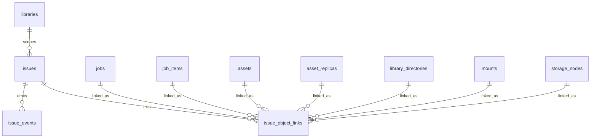

# 统一文件管理系统-异常域数据库设计

## 文档说明

- 更新时间：2026-04-08
- 适用范围：中心服务 PostgreSQL 主数据库中的异常域核心表
- 文档目标：冻结异常主对象、异常事件流、异常关联对象的数据库设计口径，作为后续 SQL migration、Repository、Service 实现的直接依据
- 当前状态：已结合现有异常中心界面、任务域数据库设计、资产域数据库设计、存储域数据库设计完成第一版可实施设计

## 1. 设计范围

本设计覆盖异常域核心 3 张表：

1. `issues`
2. `issue_events`
3. `issue_object_links`

本设计会显式衔接以下已冻结表，但不重复展开其详细字段：

- `libraries`
- `jobs`
- `job_items`
- `job_attempts`
- `assets`
- `asset_replicas`
- `library_directories`
- `mounts`
- `storage_nodes`

本设计暂不展开以下外围表，但会预留衔接边界：

- `notifications`
- `import_device_sessions`
- `import_plans`
- `worker_registrations`
- 系统策略域中的异常治理配置

## 2. 已冻结业务前提

### 2.1 异常模型前提

- 异常中心是统一治理入口，不是简单的错误日志列表。
- 异常可以来自：
  - 传输任务
  - 其他任务
  - 文件中心
  - 存储节点
  - 系统治理
  - 导入前预检或导入过程
- 异常可以附着在主任务，也可以附着在任务子项，还可以直接附着在资产、副本、目录、挂载或存储节点。
- 扫描发现文件消失时，先生成异常提醒，不直接删除资产。
- 异常需要支持轻量处置动作：
  - 重试
  - 标记已确认
  - 延后
  - 忽略
  - 刷新检测
  - 归档

### 2.2 异常治理前提

- 异常是治理对象，不是一次性错误事件。
- 同一底层问题在连续扫描、连续重试、连续任务回写中，不应机械生成大量重复异常。
- 异常必须保留历史动作轨迹，供详情页和治理回溯使用。
- 异常状态不等于任务状态；任务恢复、失败、重试可能影响异常，但异常是独立对象。

### 2.3 技术前提

- 主数据库为 PostgreSQL。
- 第一版字段类型优先采用 `text + check constraint`，不急于引入 PostgreSQL enum。
- 异常域必须与任务域、资产域、存储域保持单一事实源，不重复持有它们的权威状态。
- 异常动作能力优先采用“服务层按状态与来源推导”，不单独持久化一整张能力配置表。

## 3. 总体设计原则

### 3.1 异常对象与异常事件分离

- `issues` 表达当前仍被治理的异常对象和其最新摘要。
- `issue_events` 表达异常的发现、状态变化、处置动作和自动化处理轨迹。

### 3.2 异常域不持有业务事实，只持有治理事实

- 任务当前状态仍以 `jobs` / `job_items` / `job_attempts` 为准。
- 资产与副本当前状态仍以 `assets` / `asset_replicas` 为准。
- 挂载与存储节点当前状态仍以 `mounts` / `storage_nodes` / `mount_runtime` / `storage_node_runtime` 为准。
- 异常域只记录“什么问题正在被治理、影响哪些对象、当前治理到什么阶段”。

### 3.3 异常主表保留快照字段

- 异常列表和详情页高频需要：
  - 标题
  - 摘要
  - 影响对象文案
  - 建议动作
  - 来源摘要
  - 影响范围摘要
- 这些内容不应每次都跨多个域做实时拼装，因此 `issues` 保留快照字段是合理的。

### 3.4 统一关联表，而不是为每类对象单独建异常关联表

本设计选择 `issue_object_links`，而不是拆成：

- `issue_job_links`
- `issue_asset_links`
- `issue_mount_links`
- `issue_storage_node_links`

原因：

- 一个异常往往同时关联多个对象和多个角色。
- 当前异常中心详情需要同时展示：
  - 关联任务
  - 关联任务子项
  - 关联端点
  - 关联路径
  - 影响对象
- 如果拆成多张表，治理查询和上下文聚焦会很散，后续再接导入域也还会继续加表。

代价：

- `issue_object_links` 的约束会更复杂。

结论：

- 第一版接受这个复杂度，换取扩展性和查询统一性。

### 3.5 异常能力按规则推导，不直接固化为数据库字段

当前客户端 `IssueCapabilities` 更像“前端视图层能力快照”。

后端第一版不建议把这些布尔开关直接固化进数据库主表，而建议按以下因素在服务层推导：

- 异常状态
- 异常来源域
- 异常分类
- 是否仍存在关联任务或对象

原因：

- 否则后续每次规则变动都需要回填数据库。

## 4. 表清单与职责

### 4.1 `issues`

职责：异常主表，表达一个可治理、可聚焦、可跳转、可汇总的异常对象。

### 4.2 `issue_events`

职责：异常事件表，表达异常的发现、状态变化、处置动作和系统自动处理轨迹。

### 4.3 `issue_object_links`

职责：异常关联对象表，表达异常与任务、子项、资产、副本、目录、挂载、存储节点之间的关系和角色。

## 5. 表设计

## 5.1 `issues`

### 5.1.1 字段设计

| 字段名 | 类型 | 必填 | 默认值 | 说明 |
| --- | --- | --- | --- | --- |
| `id` | `uuid` | 是 | `gen_random_uuid()` | 主键 |
| `code` | `text` | 是 | 无 | 稳定异常标识，便于日志、通知、跳转 |
| `library_id` | `uuid` | 否 | `null` | 所属资产库，系统级异常可为空 |
| `issue_category` | `text` | 是 | 无 | 一级分类 |
| `issue_type` | `text` | 是 | 无 | 细分类型，如路径冲突、鉴权失败、容量不足 |
| `nature` | `text` | 是 | 无 | 问题性质，如阻塞或风险 |
| `source_domain` | `text` | 是 | 无 | 来源域 |
| `severity` | `text` | 是 | 无 | 严重级别 |
| `status` | `text` | 是 | `'OPEN'` | 当前治理状态 |
| `dedupe_key` | `text` | 否 | `null` | 去重键，由服务层生成 |
| `title` | `text` | 是 | 无 | 列表标题 |
| `summary` | `text` | 是 | 无 | 列表摘要 |
| `object_label` | `text` | 是 | 无 | 当前影响对象文案 |
| `asset_label` | `text` | 否 | `null` | 资产文案快照 |
| `suggested_action` | `text` | 否 | `null` | 建议动作编码 |
| `suggested_action_label` | `text` | 否 | `null` | 建议动作文案 |
| `suggestion` | `text` | 否 | `null` | 处理建议 |
| `detail` | `text` | 否 | `null` | 详细说明 |
| `source_snapshot` | `jsonb` | 否 | `null` | 来源上下文快照 |
| `impact_snapshot` | `jsonb` | 否 | `null` | 影响范围快照 |
| `first_detected_at` | `timestamptz` | 是 | `now()` | 首次发现时间 |
| `last_detected_at` | `timestamptz` | 是 | `now()` | 最近一次确认仍存在的时间 |
| `last_status_changed_at` | `timestamptz` | 是 | `now()` | 最近状态切换时间 |
| `resolved_at` | `timestamptz` | 否 | `null` | 解决时间 |
| `archived_at` | `timestamptz` | 否 | `null` | 归档时间 |
| `latest_event_at` | `timestamptz` | 否 | `null` | 最近事件时间快照 |
| `latest_error_code` | `text` | 否 | `null` | 最近错误码 |
| `latest_error_message` | `text` | 否 | `null` | 最近错误摘要 |
| `created_at` | `timestamptz` | 是 | `now()` | 创建时间 |
| `updated_at` | `timestamptz` | 是 | `now()` | 更新时间 |

### 5.1.2 约束设计

- 主键：`pk_issues (id)`
- 外键：
  - `fk_issues_library_id -> libraries(id)`
- 唯一约束：
  - `ux_issues_code (code)`
- 检查约束：
  - `issue_category in ('CONFLICT', 'TRANSFER', 'VERIFY', 'NODE_PERMISSION', 'CAPACITY_RESOURCE', 'SCAN_PARSE', 'CLEANUP_GOVERNANCE')`
  - `nature in ('BLOCKING', 'RISK')`
  - `source_domain in ('TRANSFER_JOB', 'MAINTENANCE_JOB', 'FILE_CENTER', 'STORAGE_DOMAIN', 'SYSTEM_GOVERNANCE', 'IMPORT_DOMAIN')`
  - `severity in ('CRITICAL', 'WARNING', 'INFO')`
  - `status in ('OPEN', 'AWAITING_CONFIRMATION', 'IN_PROGRESS', 'POSTPONED', 'IGNORED', 'RESOLVED', 'ARCHIVED')`
  - `title <> ''`
  - `summary <> ''`
  - `object_label <> ''`

### 5.1.3 索引建议

- `ux_issues_code(code)`
- `idx_issues_library_status(library_id, status)`
- `idx_issues_category_status(issue_category, status)`
- `idx_issues_source_domain_status(source_domain, status)`
- `idx_issues_nature_status(nature, status)`
- `idx_issues_severity_status(severity, status)`
- `idx_issues_last_detected(last_detected_at desc)`
- `idx_issues_updated(updated_at desc)`
- `idx_issues_dedupe_key(dedupe_key)`  
  说明：先做普通索引，不急着做唯一约束

### 5.1.4 设计说明

- `dedupe_key` 保留，但第一版不强制唯一。  
  原因：异常重开、状态恢复、跨周期复现时，是否复用旧异常对象还需要服务层策略控制。
- `source_snapshot` 和 `impact_snapshot` 都值得保留。  
  原因：异常详情页高频展示上下文和影响范围，完全依赖实时聚合成本高。
- `suggested_action` / `suggested_action_label` 保留在主表。  
  原因：这是异常当前治理入口的一部分，适合快速展示。

## 5.2 `issue_events`

### 5.2.1 字段设计

| 字段名 | 类型 | 必填 | 默认值 | 说明 |
| --- | --- | --- | --- | --- |
| `id` | `uuid` | 是 | `gen_random_uuid()` | 主键 |
| `issue_id` | `uuid` | 是 | 无 | 所属异常 |
| `sequence_no` | `integer` | 是 | 无 | 在异常内递增序号 |
| `event_type` | `text` | 是 | 无 | 事件类型 |
| `action_key` | `text` | 否 | `null` | 若由治理动作触发，则记录动作编码 |
| `from_status` | `text` | 否 | `null` | 旧状态 |
| `to_status` | `text` | 否 | `null` | 新状态 |
| `actor_type` | `text` | 是 | 无 | 操作者类型 |
| `actor_ref_id` | `uuid` | 否 | `null` | 操作者 ID，当前不强绑外键 |
| `operator_label` | `text` | 否 | `null` | 操作者显示名 |
| `message` | `text` | 否 | `null` | 人类可读文案 |
| `payload` | `jsonb` | 否 | `null` | 结构化事件内容 |
| `created_at` | `timestamptz` | 是 | `now()` | 事件时间 |

### 5.2.2 约束设计

- 主键：`pk_issue_events (id)`
- 外键：
  - `fk_issue_events_issue_id -> issues(id)`
- 唯一约束：
  - `ux_issue_events_issue_seq (issue_id, sequence_no)`
- 检查约束：
  - `event_type in ('DETECTED', 'UPDATED', 'STATUS_CHANGED', 'RETRY_REQUESTED', 'CONFIRMED', 'POSTPONED', 'IGNORED', 'REFRESHED', 'RESOLVED', 'ARCHIVED', 'AUTO_REOPENED')`
  - `actor_type in ('USER', 'SYSTEM', 'SERVICE', 'AGENT', 'SCHEDULER')`

### 5.2.3 索引建议

- `ux_issue_events_issue_seq(issue_id, sequence_no)`
- `idx_issue_events_issue_created(issue_id, created_at desc)`
- `idx_issue_events_type_created(event_type, created_at desc)`
- `idx_issue_events_actor(actor_type, created_at desc)`

### 5.2.4 设计说明

- `issue_events` 是异常详情页历史区和治理回溯的基础，不能省。
- `message + payload` 同时保留。  
  原因：
  - `message` 适合直接展示
  - `payload` 适合结构化处理
- 第一版不单独拆“治理动作表”。  
  原因：异常历史本质上就是治理动作和状态变化事件，单独再拆一张动作表价值不大。

## 5.3 `issue_object_links`

### 5.3.1 设计选择

本设计选择 **统一关联表 `issue_object_links`**，而不是拆成：

- `issue_job_links`
- `issue_asset_links`
- `issue_mount_links`
- `issue_storage_node_links`

原因：

- 一个异常通常同时关联多个对象和多个角色。
- 当前异常中心详情需要同时展示：
  - 来源任务
  - 来源任务子项
  - 影响资产
  - 影响副本
  - 关联目录
  - 关联挂载
  - 关联端点
- 统一表更适合治理查询、上下文聚焦和后续扩展。

### 5.3.2 字段设计

| 字段名 | 类型 | 必填 | 默认值 | 说明 |
| --- | --- | --- | --- | --- |
| `id` | `uuid` | 是 | `gen_random_uuid()` | 主键 |
| `issue_id` | `uuid` | 是 | 无 | 所属异常 |
| `link_role` | `text` | 是 | 无 | 关联角色 |
| `object_type` | `text` | 是 | 无 | 对象类型 |
| `job_id` | `uuid` | 否 | `null` | 关联主任务 |
| `job_item_id` | `uuid` | 否 | `null` | 关联子项 |
| `asset_id` | `uuid` | 否 | `null` | 关联资产 |
| `asset_replica_id` | `uuid` | 否 | `null` | 关联副本 |
| `directory_id` | `uuid` | 否 | `null` | 关联目录 |
| `mount_id` | `uuid` | 否 | `null` | 关联挂载 |
| `storage_node_id` | `uuid` | 否 | `null` | 关联存储节点 |
| `external_ref_type` | `text` | 否 | `null` | 尚未建表对象类型，如导入会话 |
| `external_ref_id` | `uuid` | 否 | `null` | 尚未建表对象 ID |
| `object_label` | `text` | 否 | `null` | 关联对象展示快照 |
| `created_at` | `timestamptz` | 是 | `now()` | 创建时间 |

### 5.3.3 约束设计

- 主键：`pk_issue_object_links (id)`
- 外键：
  - `fk_issue_object_links_issue_id -> issues(id)`
  - `fk_issue_object_links_job_id -> jobs(id)`
  - `fk_issue_object_links_job_item_id -> job_items(id)`
  - `fk_issue_object_links_asset_id -> assets(id)`
  - `fk_issue_object_links_asset_replica_id -> asset_replicas(id)`
  - `fk_issue_object_links_directory_id -> library_directories(id)`
  - `fk_issue_object_links_mount_id -> mounts(id)`
  - `fk_issue_object_links_storage_node_id -> storage_nodes(id)`
- 唯一约束：
  - `ux_issue_object_links_issue_role_object`  
    建议组合：
    `(issue_id, link_role, object_type, coalesce(job_id, '00000000-0000-0000-0000-000000000000'), coalesce(job_item_id, '00000000-0000-0000-0000-000000000000'), coalesce(asset_id, '00000000-0000-0000-0000-000000000000'), coalesce(asset_replica_id, '00000000-0000-0000-0000-000000000000'), coalesce(directory_id, '00000000-0000-0000-0000-000000000000'), coalesce(mount_id, '00000000-0000-0000-0000-000000000000'), coalesce(storage_node_id, '00000000-0000-0000-0000-000000000000'), coalesce(external_ref_id, '00000000-0000-0000-0000-000000000000'))`
- 检查约束：
  - `link_role in ('SOURCE_JOB', 'SOURCE_JOB_ITEM', 'PRIMARY_SUBJECT', 'AFFECTED_ASSET', 'AFFECTED_REPLICA', 'AFFECTED_DIRECTORY', 'AFFECTED_MOUNT', 'AFFECTED_STORAGE_NODE', 'RELATED_OBJECT')`
  - `object_type in ('JOB', 'JOB_ITEM', 'ASSET', 'ASSET_REPLICA', 'DIRECTORY', 'MOUNT', 'STORAGE_NODE', 'EXTERNAL_REF')`
  - 必须恰好关联一种对象：
    - `num_nonnulls(job_id, job_item_id, asset_id, asset_replica_id, directory_id, mount_id, storage_node_id, external_ref_id) = 1`

### 5.3.4 索引建议

- `idx_issue_object_links_issue(issue_id)`
- `idx_issue_object_links_job(job_id)`
- `idx_issue_object_links_job_item(job_item_id)`
- `idx_issue_object_links_asset(asset_id)`
- `idx_issue_object_links_replica(asset_replica_id)`
- `idx_issue_object_links_directory(directory_id)`
- `idx_issue_object_links_mount(mount_id)`
- `idx_issue_object_links_storage_node(storage_node_id)`
- `idx_issue_object_links_role(link_role, object_type)`

### 5.3.5 设计说明

- `external_ref_type + external_ref_id` 是刻意保留的过渡设计。  
  原因：导入域表还没展开，但异常已经可能需要关联导入会话或预检对象。
- `object_label` 值得保留。  
  原因：异常详情页需要稳定展示对象名称，避免对象被删除或重命名后历史信息丢失。

## 6. 表关系图谱

### 6.1 关系解释

- 一个 `issue` 可以有多个 `issue_events`
- 一个 `issue` 可以关联多个对象
- 一个 `job` / `job_item` / `asset` / `asset_replica` / `directory` / `mount` / `storage_node` 也都可能被多个异常引用
- `libraries` 直接挂到 `issues`，表示异常的主归属资产库

## 7. 关键设计决策

1. 异常域主模型只保留 3 张核心表：`issues`、`issue_events`、`issue_object_links`
2. 异常是治理对象，不是一次性错误日志
3. `issues` 保留快照字段，便于异常中心列表和详情高频查询
4. `IssueCapabilities` 不直接入库，改为服务层按状态和来源推导
5. `issue_events` 统一承载发现、状态变化和治理动作历史
6. 任务、资产、副本、目录、挂载、存储节点统一通过 `issue_object_links` 建模
7. `issue_object_links` 支持过渡期的 `EXTERNAL_REF`，用于未来导入域关联
8. `dedupe_key` 入库但第一版不强制唯一，避免过早固化重开策略
9. 异常状态与任务状态分离，异常不是任务状态的附属字段
10. 异常域不重复持有其它域的权威事实，只记录治理所需快照

## 8. 建议重点审阅的 5 个点

1. 是否接受异常域只用 3 张核心表，而不再单独拆“动作表”或“能力表”  
建议：接受。

2. 是否接受 `issue_object_links` 作为统一关联表，而不是拆成多张对象关联表  
建议：接受。

3. 是否接受 `IssueCapabilities` 不直接入库，由服务层推导  
建议：接受。

4. 是否接受 `dedupe_key` 第一版只建普通索引，不做唯一约束  
建议：接受。

5. 是否接受 `issues` 保留 `source_snapshot` 和 `impact_snapshot`  
建议：接受。

## 9. 仍存在的 trade-off 与推荐方案

### 9.1 `dedupe_key` 是否做唯一约束

- 方案 A：对活动态异常做部分唯一约束
- 方案 B：只做普通索引，去重逻辑放服务层

推荐：方案 B。  
原因：异常重开、跨周期复现、导入预检转运行期异常等场景还需要更灵活策略。

### 9.2 `issue_events` 是否只存结构化 `payload`

- 方案 A：只有 `payload`
- 方案 B：`message + payload`

推荐：方案 B。  
原因：机器处理和人类展示同时满足。

### 9.3 `issues` 是否直接保留影响范围计数字段

- 方案 A：全部从关联对象实时聚合
- 方案 B：保留 `impact_snapshot`

推荐：方案 B。  
原因：异常中心详情页和列表过滤需要快速展示，不适合高频跨表聚合。

## 10. 审阅结论

如果本稿通过，可以把这 3 张表视为异常域数据库设计的第一份冻结稿。

后续最自然的下一步有两个：

1. 基于本稿继续整理为可直接落地的 PostgreSQL migration 设计草案。
2. 继续补与异常域强相关的外围表：
   - `notifications`
   - `import_device_sessions`
   - `import_plans`
   - 异常治理系统策略明细

当前最推荐先进入 `notifications` 设计，因为异常域与通知域天然是一条事件派生链路。
