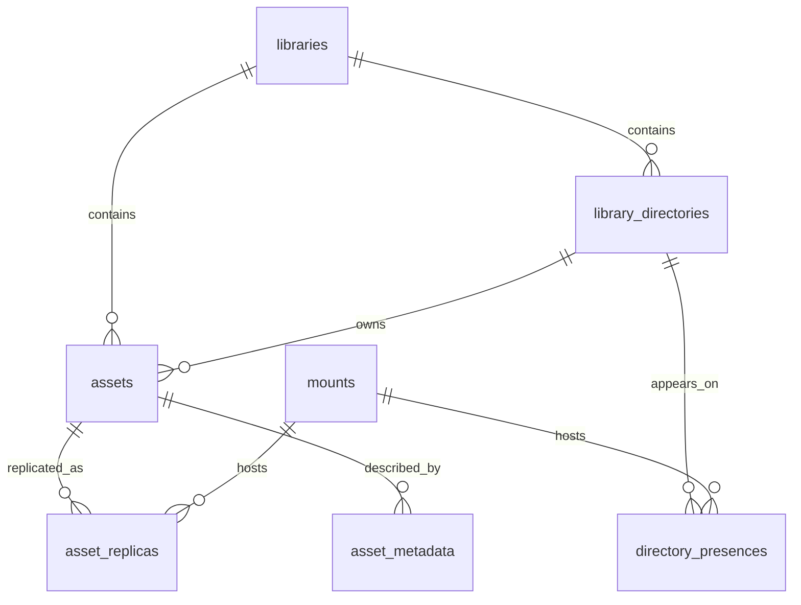

# 统一文件管理系统-资产域数据库设计

## 文档说明

- 更新时间：2026-04-11
- 适用范围：中心服务 PostgreSQL 主数据库中的资产域核心表
- 文档目标：冻结资产库、目录树、文件资产、副本、目录存在状态、资产元数据的数据库设计口径，作为后续 SQL migration、Repository、Service 实现的直接依据
- 当前状态：设计稿已与 `services/center/migrations/0003_assets_read_model.sql` 的已落地实现并行存在；当前仓库里的真实字段与删除语义以已落地 SQL 和服务实现为准

## 0.1 当前实现优先级说明

本文最初用于冻结资产域设计方向，但截至 2026-04-11，仓库里已经存在真实 migration 与服务实现，因此需要明确以下优先级：

- 当前实际表结构以 `services/center/migrations/0003_assets_read_model.sql` 为准
- 当前实际读写行为以 `services/center/internal/assets/*.go` 为准
- 本文中未与已落地实现同步的部分，应视为“未来设计目标”，不能直接当作当前实现

当前最需要注意的实现差异有：

- 已实现：`libraries`、`library_directories`、`assets`、`asset_replicas`、`directory_presences`、`asset_metadata` 六张核心表
- 已实现：扫描会更新 `directory_presences` / `asset_replicas` 的存在状态与时间字段
- 已实现：文件级星级、色标可直接写入 `assets`
- 当前实现不同：条目删除走真实物理删除 + 数据行硬删除，尚未演进为完整的软删除状态流转
- 当前未实现：标签表、标签绑定、云端写入 / 删除的完整资产域闭环

## 1. 设计范围

本设计仅覆盖资产域核心 6 张表：

1. `libraries`
2. `library_directories`
3. `assets`
4. `asset_replicas`
5. `directory_presences`
6. `asset_metadata`

本设计暂不展开以下外围表，但会预留关联关系：

- `storage_nodes`
- `mounts`
- `jobs`
- `issues`
- `tags`

## 2. 已冻结业务前提

### 2.1 资产模型前提

- 文件即资产。
- 一个资产库只允许有一个逻辑根目录。
- 多个挂载进入同一个资产库时，必须共用同一套目录结构。
- 日常同一资产判定规则为：`相对路径 + 文件名 + 文件大小`。
- 深度校验仅用于归档后的定时或手动校验，不参与日常唯一性判定。

### 2.2 删除与缺失前提

- 删除最后一个副本时，资产进入删除流程。
- 扫描发现文件消失时，先记录副本缺失事实，并生成异常提醒，不直接删除资产。
- 资产主记录不建议直接物理删除，优先通过生命周期状态流转表达删除过程。
- 补充说明：当前 `DeleteEntry` 的真实实现尚未采用这条策略，而是对 LOCAL / NAS 路径执行物理删除后直接删除相关数据行。

### 2.3 技术前提

- 主数据库为 PostgreSQL。
- 第一版字段类型优先采用 `text + check constraint`，不急于引入 PostgreSQL enum。
- 允许适度冗余字段，以换取目录树查询、路径跳转、资产定位和日志追踪的稳定性。

## 3. 总体设计原则

### 3.1 命名空间与事实分离

- `libraries` 只负责定义资产库命名空间。
- `library_directories` 与 `assets` 负责逻辑目录树与文件资产本体。
- `asset_replicas` 与 `directory_presences` 负责各挂载上的物理存在事实。

### 3.2 逻辑路径与物理路径分离

- 逻辑路径由资产库和目录树定义。
- 物理路径由挂载上的副本和目录存在状态表定义。
- 不允许在多个表中无约束地重复保存同一种路径事实。

### 3.3 单一主事实源

- 资产逻辑路径以 `assets.relative_path` 为准。
- 目录逻辑路径以 `library_directories.relative_path` 为准。
- 副本所属挂载与所在物理位置以 `asset_replicas.mount_id + physical_path` 为准。

### 3.4 显式目录节点

- 目录表只保存根目录、扫描到的目录、手动创建的目录。
- 不保存纯推导目录。

## 4. 表清单与职责

### 4.1 `libraries`

职责：资产库主表，定义资产库本体，不承载目录或副本事实。

### 4.2 `library_directories`

职责：资产库目录树骨架表，只保存显式目录节点。

### 4.3 `assets`

职责：文件资产主表，表达资产库逻辑路径下的文件资产本体。

### 4.4 `asset_replicas`

职责：资产在不同挂载上的副本事实表，表达副本当前的存在状态、同步状态、校验状态和物理位置。

### 4.5 `directory_presences`

职责：目录在不同挂载上的存在状态表，表达逻辑目录在某个挂载上的实际可见性。

### 4.6 `asset_metadata`

职责：资产元数据表，承载扫描、导入、解析、校验和用户补充的元数据。

## 5. 表设计

## 5.1 `libraries`

### 5.1.1 字段设计

| 字段名 | 类型 | 必填 | 默认值 | 说明 |
| --- | --- | --- | --- | --- |
| `id` | `uuid` | 是 | `gen_random_uuid()` | 主键 |
| `code` | `text` | 是 | 无 | 稳定业务标识 |
| `name` | `text` | 是 | 无 | 资产库名称 |
| `root_label` | `text` | 是 | 无 | 根目录展示名 |
| `status` | `text` | 是 | `'ACTIVE'` | 资产库状态 |
| `description` | `text` | 否 | `null` | 描述说明 |
| `created_at` | `timestamptz` | 是 | `now()` | 创建时间 |
| `updated_at` | `timestamptz` | 是 | `now()` | 更新时间 |
| `archived_at` | `timestamptz` | 否 | `null` | 归档时间 |

### 5.1.2 约束设计

- 主键：`pk_libraries (id)`
- 唯一约束：`ux_libraries_code (code)`
- 检查约束：
  - `code <> ''`
  - `name <> ''`
  - `root_label <> ''`
  - `status in ('ACTIVE', 'DISABLED', 'ARCHIVED')`

### 5.1.3 索引建议

- `ux_libraries_code(code)`
- `idx_libraries_status(status)`

### 5.1.4 设计说明

- `root_label` 保留，不直接用 `name` 替代。
- `code` 视为稳定业务标识，创建后尽量不修改。
- `status = ARCHIVED` 后不应再接受新目录或新资产写入。

## 5.2 `library_directories`

### 5.2.1 字段设计

| 字段名 | 类型 | 必填 | 默认值 | 说明 |
| --- | --- | --- | --- | --- |
| `id` | `uuid` | 是 | `gen_random_uuid()` | 主键 |
| `library_id` | `uuid` | 是 | 无 | 所属资产库 |
| `relative_path` | `text` | 是 | 无 | 目录相对路径，根目录固定为 `'/'` |
| `name` | `text` | 是 | 无 | 当前目录名 |
| `parent_path` | `text` | 否 | `null` | 父目录相对路径，根目录为 `null` |
| `depth` | `integer` | 是 | `0` | 目录深度，根目录为 0 |
| `source_kind` | `text` | 是 | `'SCANNED'` | 节点来源 |
| `status` | `text` | 是 | `'ACTIVE'` | 目录节点状态 |
| `sort_name` | `text` | 是 | 无 | 规范化排序名 |
| `created_at` | `timestamptz` | 是 | `now()` | 创建时间 |
| `updated_at` | `timestamptz` | 是 | `now()` | 更新时间 |

### 5.2.2 约束设计

- 主键：`pk_library_directories (id)`
- 外键：`fk_library_directories_library_id -> libraries(id)`
- 唯一约束：`ux_library_directories_library_path (library_id, relative_path)`
- 检查约束：
  - 根目录规则：
    - `relative_path = '/'` 时，`parent_path is null and depth = 0`
  - 非根目录规则：
    - `relative_path <> '/'` 时，`parent_path is not null and depth > 0`
  - `source_kind in ('SCANNED', 'MANUAL')`
  - `status in ('ACTIVE', 'HIDDEN', 'DELETED')`
  - `name <> ''`
  - `sort_name <> ''`

### 5.2.3 索引建议

- `ux_library_directories_library_path(library_id, relative_path)`
- `idx_library_directories_library_parent(library_id, parent_path)`
- `idx_library_directories_library_depth(library_id, depth)`
- `idx_library_directories_library_sort(library_id, parent_path, sort_name)`

### 5.2.4 设计说明

- `parent_path` 是有意识保留的冗余字段，用来简化目录树查询与子目录枚举。
- `depth` 和 `sort_name` 也是有意识保留的冗余字段，用于层级过滤和排序性能。
- 当前不建议支持目录 rename；如果未来支持，需要专门设计路径重写事务。

### 5.2.5 写入规则

- 创建资产库后，必须立刻创建根目录记录：
  - `relative_path = '/'`
  - `parent_path = null`
  - `depth = 0`
- 非根目录写入前，必须确保父目录已存在。
- `status = DELETED` 前应先确认不存在子目录和资产依赖。

## 5.3 `assets`

### 5.3.1 字段设计

| 字段名 | 类型 | 必填 | 默认值 | 说明 |
| --- | --- | --- | --- | --- |
| `id` | `uuid` | 是 | `gen_random_uuid()` | 主键 |
| `library_id` | `uuid` | 是 | 无 | 所属资产库 |
| `directory_id` | `uuid` | 是 | 无 | 所属目录 |
| `relative_path` | `text` | 是 | 无 | 文件完整相对路径，如 `/a/b/c.jpg` |
| `name` | `text` | 是 | 无 | 文件名 |
| `extension` | `text` | 否 | `null` | 扩展名，建议小写且不含点 |
| `size_bytes` | `bigint` | 是 | 无 | 当前资产标准大小 |
| `mime_type` | `text` | 否 | `null` | 推断 MIME |
| `file_kind` | `text` | 是 | `'DOCUMENT'` | 业务文件类型 |
| `lifecycle_state` | `text` | 是 | `'ACTIVE'` | 生命周期状态 |
| `rating` | `smallint` | 是 | `0` | 星级，范围 0-5 |
| `color_label` | `text` | 是 | `'NONE'` | 色标 |
| `note` | `text` | 否 | `null` | 用户备注 |
| `canonical_modified_at` | `timestamptz` | 否 | `null` | 当前资产标准修改时间 |
| `content_changed_at` | `timestamptz` | 否 | `null` | 最近一次检测到内容变化的时间 |
| `created_at` | `timestamptz` | 是 | `now()` | 创建时间 |
| `updated_at` | `timestamptz` | 是 | `now()` | 更新时间 |
| `deleted_at` | `timestamptz` | 否 | `null` | 删除时间 |

### 5.3.2 约束设计

- 主键：`pk_assets (id)`
- 外键：
  - `fk_assets_library_id -> libraries(id)`
  - `fk_assets_directory_id -> library_directories(id)`
- 唯一约束：`ux_assets_library_path (library_id, relative_path)`
- 检查约束：
  - `size_bytes >= 0`
  - `rating between 0 and 5`
  - `file_kind in ('IMAGE', 'VIDEO', 'AUDIO', 'DOCUMENT', 'ARCHIVE', 'OTHER')`
  - `lifecycle_state in ('ACTIVE', 'DELETE_PENDING', 'DELETED')`
  - `color_label in ('NONE', 'RED', 'YELLOW', 'GREEN', 'BLUE', 'PURPLE')`
  - `name <> ''`
  - `relative_path <> '/'`

### 5.3.3 索引建议

- `ux_assets_library_path(library_id, relative_path)`
- `idx_assets_library_directory(library_id, directory_id)`
- `idx_assets_library_name(library_id, name)`
- `idx_assets_library_kind(library_id, file_kind)`
- `idx_assets_library_lifecycle(library_id, lifecycle_state)`
- `idx_assets_library_updated(library_id, updated_at desc)`
- `idx_assets_library_size(library_id, size_bytes)`

### 5.3.4 设计说明

- 同时保留 `relative_path`、`directory_id`、`name`，是有意识的冗余设计。
- 资产唯一性按 `(library_id, relative_path)` 确定，不把 `size_bytes` 放进唯一约束。
- 同一路径文件大小变化时，不新建第二条资产，而是更新 `size_bytes` 与 `content_changed_at`。

### 5.3.5 应用层强校验规则

- `relative_path` 的最后一级必须等于 `name`
- `directory_id` 对应目录的 `relative_path` 必须是当前文件的父目录路径

### 5.3.6 删除规则

- 资产删除建议先走软删除状态：
  - `ACTIVE -> DELETE_PENDING -> DELETED`
- 是否物理清理记录，应延后到归档或清理策略阶段处理。

## 5.4 `asset_replicas`

### 5.4.1 字段设计

| 字段名 | 类型 | 必填 | 默认值 | 说明 |
| --- | --- | --- | --- | --- |
| `id` | `uuid` | 是 | `gen_random_uuid()` | 主键 |
| `asset_id` | `uuid` | 是 | 无 | 所属资产 |
| `mount_id` | `uuid` | 是 | 无 | 所属挂载 |
| `physical_path` | `text` | 是 | 无 | 当前挂载上的物理路径 |
| `size_bytes` | `bigint` | 是 | 无 | 当前副本大小 |
| `modified_at` | `timestamptz` | 否 | `null` | 当前副本修改时间 |
| `replica_state` | `text` | 是 | `'AVAILABLE'` | 副本存在状态 |
| `sync_state` | `text` | 是 | `'UNKNOWN'` | 同步状态 |
| `verification_state` | `text` | 是 | `'UNVERIFIED'` | 校验状态 |
| `quick_hash` | `text` | 否 | `null` | 轻量校验值 |
| `quick_hash_algorithm` | `text` | 否 | `null` | 轻量校验算法标识 |
| `quick_hash_at` | `timestamptz` | 否 | `null` | 最近轻量校验时间 |
| `hash_verified_at` | `timestamptz` | 否 | `null` | 最近强校验时间 |
| `last_seen_at` | `timestamptz` | 是 | 无 | 最近扫描看到时间 |
| `missing_detected_at` | `timestamptz` | 否 | `null` | 最近发现缺失时间 |
| `delete_requested_at` | `timestamptz` | 否 | `null` | 删除请求时间 |
| `last_error_code` | `text` | 否 | `null` | 最近错误码 |
| `last_error_message` | `text` | 否 | `null` | 最近错误说明 |
| `created_at` | `timestamptz` | 是 | `now()` | 创建时间 |
| `updated_at` | `timestamptz` | 是 | `now()` | 更新时间 |

### 5.4.2 约束设计

- 主键：`pk_asset_replicas (id)`
- 外键：
  - `fk_asset_replicas_asset_id -> assets(id)`
  - `fk_asset_replicas_mount_id -> mounts(id)`
- 唯一约束：
  - `ux_asset_replicas_asset_mount (asset_id, mount_id)`
  - `ux_asset_replicas_mount_physical_path (mount_id, physical_path)`
- 检查约束：
  - `size_bytes >= 0`
  - `replica_state in ('AVAILABLE', 'MISSING', 'ERROR', 'DELETE_PENDING', 'DELETED')`
  - `sync_state in ('IN_SYNC', 'OUT_OF_SYNC', 'UNKNOWN')`
  - `verification_state in ('UNVERIFIED', 'PASSED', 'FAILED', 'MISMATCH')`
  - `physical_path <> ''`

### 5.4.3 索引建议

- `ux_asset_replicas_asset_mount(asset_id, mount_id)`
- `ux_asset_replicas_mount_physical_path(mount_id, physical_path)`
- `idx_asset_replicas_mount_state(mount_id, replica_state)`
- `idx_asset_replicas_asset_state(asset_id, replica_state)`
- `idx_asset_replicas_last_seen(last_seen_at)`
- `idx_asset_replicas_missing_detected(missing_detected_at)`
- `idx_asset_replicas_sync_state(sync_state)`

### 5.4.4 设计说明

- 推荐不单独保存 `storage_node_id`，由 `mount_id` 推导。
- 推荐不在此表重复保存逻辑 `relative_path`，逻辑路径统一从 `assets.relative_path` 取。
- `physical_path` 必须保留，因为执行器、异常、日志和实际操作都依赖它。

### 5.4.5 写入与更新规则

- 扫描命中时，更新：
  - `last_seen_at`
  - `size_bytes`
  - `modified_at`
- 扫描发现缺失时，不删副本记录，只更新：
  - `replica_state = 'MISSING'`
  - `missing_detected_at = now()`
- 删除请求发起时：
  - `replica_state = 'DELETE_PENDING'`
  - `delete_requested_at = now()`
- 若该副本删除后没有其他有效副本，触发资产删除流程，但扫描链路不直接删资产。

## 5.5 `directory_presences`

### 5.5.1 字段设计

| 字段名 | 类型 | 必填 | 默认值 | 说明 |
| --- | --- | --- | --- | --- |
| `id` | `uuid` | 是 | `gen_random_uuid()` | 主键 |
| `directory_id` | `uuid` | 是 | 无 | 目录节点 ID |
| `mount_id` | `uuid` | 是 | 无 | 挂载 ID |
| `physical_path` | `text` | 是 | 无 | 该目录在挂载上的物理路径 |
| `presence_state` | `text` | 是 | `'PRESENT'` | 目录存在状态 |
| `last_seen_at` | `timestamptz` | 是 | 无 | 最近看到时间 |
| `missing_detected_at` | `timestamptz` | 否 | `null` | 最近发现缺失时间 |
| `created_at` | `timestamptz` | 是 | `now()` | 创建时间 |
| `updated_at` | `timestamptz` | 是 | `now()` | 更新时间 |

### 5.5.2 约束设计

- 主键：`pk_directory_presences (id)`
- 外键：
  - `fk_directory_presences_directory_id -> library_directories(id)`
  - `fk_directory_presences_mount_id -> mounts(id)`
- 唯一约束：`ux_directory_presences_directory_mount (directory_id, mount_id)`
- 检查约束：
  - `presence_state in ('PRESENT', 'MISSING', 'UNKNOWN')`
  - `physical_path <> ''`

### 5.5.3 索引建议

- `ux_directory_presences_directory_mount(directory_id, mount_id)`
- `idx_directory_presences_mount_state(mount_id, presence_state)`
- `idx_directory_presences_last_seen(last_seen_at)`

### 5.5.4 设计说明

- `library_directories.status` 表达目录节点是否存在于逻辑树中。
- `directory_presences.presence_state` 表达该逻辑目录在某个挂载上是否实际可见。
- 这两个语义必须分离，不能混用。

## 5.6 `asset_metadata`

### 5.6.1 字段设计

| 字段名 | 类型 | 必填 | 默认值 | 说明 |
| --- | --- | --- | --- | --- |
| `id` | `uuid` | 是 | `gen_random_uuid()` | 主键 |
| `asset_id` | `uuid` | 是 | 无 | 所属资产 |
| `namespace` | `text` | 是 | 无 | 元数据命名空间 |
| `meta_key` | `text` | 是 | 无 | 元数据键 |
| `meta_value` | `jsonb` | 是 | 无 | 元数据值 |
| `source` | `text` | 是 | 无 | 元数据来源 |
| `created_at` | `timestamptz` | 是 | `now()` | 创建时间 |
| `updated_at` | `timestamptz` | 是 | `now()` | 更新时间 |

### 5.6.2 约束设计

- 主键：`pk_asset_metadata (id)`
- 外键：`fk_asset_metadata_asset_id -> assets(id)`
- 唯一约束：`ux_asset_metadata_asset_namespace_key (asset_id, namespace, meta_key)`
- 检查约束：
  - `namespace <> ''`
  - `meta_key <> ''`
  - `source <> ''`

### 5.6.3 索引建议

- `ux_asset_metadata_asset_namespace_key(asset_id, namespace, meta_key)`
- `idx_asset_metadata_asset(asset_id)`
- `idx_asset_metadata_namespace(namespace)`
- 后续如果出现按值检索，再考虑 `gin(meta_value)`

### 5.6.4 推荐约定值

`namespace` 建议先按约定值使用：

- `SYSTEM`
- `EXTRACTED`
- `IMPORT`
- `VERIFY`
- `USER`

`source` 建议先按约定值使用：

- `SCANNER`
- `IMPORTER`
- `PARSER`
- `VERIFIER`
- `USER`

### 5.6.5 设计说明

- 推荐用 `jsonb`，不建议当前就把 EXIF、音视频元数据、校验结果拆成大量独立列。
- 高频过滤的元数据字段，后续再抽成专表或冗余列。

## 6. 表关系图谱

### 6.1 关系解释

- 一个 `library` 拥有一棵唯一目录树，由多条 `library_directories` 组成。
- 一个 `asset` 属于一个 `library`，并且必须归属于一个 `library_directory`。
- 一个 `asset` 可以对应多个 `asset_replicas`。
- 一个 `library_directory` 可以在多个挂载上有 `directory_presences`。
- `asset_metadata` 是 `asset` 的附属信息，不参与资产唯一性判定。

## 7. 关键设计决策

1. 资产唯一性按 `(library_id, relative_path)` 确定，不把 `size_bytes` 放入唯一约束。
2. 目录树只保存显式目录节点，不保存纯推导目录。
3. 单资产库只允许一个逻辑根目录。
4. `assets` 同时保留 `relative_path`、`directory_id`、`name`，通过适度冗余换取查询与约束清晰性。
5. `asset_replicas` 只保留 `mount_id`，不再重复保留 `storage_node_id`。
6. `asset_replicas` 不再保存逻辑 `relative_path`，逻辑路径统一从 `assets` 获取。
7. 目录树状态和目录在挂载上的可见性状态拆开。
8. 副本状态、同步状态、校验状态拆开。
9. 扫描发现文件缺失时，不直接删资产或副本记录。
10. `asset_metadata` 采用 `jsonb + namespace + key` 结构。
11. 资产删除在数据库中建议保留软删除状态流转。
12. 当前不支持目录 rename。

## 8. 建议重点审阅的 5 个点

1. `asset_replicas` 是否不再保存 `storage_node_id`，只保留 `mount_id`
建议：接受。

2. `asset_replicas` 是否不再保存逻辑 `relative_path`，只保留 `physical_path`
建议：接受。

3. `asset_metadata` 是否采用 `jsonb`
建议：接受。

4. `assets` 是否采用软删除状态流转
建议：接受。

5. `library_directories` 当前是否不支持目录 rename
建议：接受。

## 9. 仍存在的 trade-off 与推荐方案

### 9.1 `library_directories` 是否增加 `parent_directory_id`

- 方案 A：增加，树关系更严谨
- 方案 B：不加，只保留 `parent_path`

推荐：第一版不加，只保留 `parent_path`，减少双重冗余。

### 9.2 `asset_replicas` 是否需要 `sync_state`

- 方案 A：只保留 `replica_state`
- 方案 B：保留 `replica_state + sync_state`

推荐：保留 `sync_state`，因为“存在”和“是否同步”是两个维度。

### 9.3 `asset_metadata` 是否提前加 GIN 索引

- 方案 A：第一版就加
- 方案 B：暂不加，按检索需求补充

推荐：第一版暂不加。

### 9.4 是否使用 PostgreSQL enum

- 方案 A：直接使用 enum
- 方案 B：使用 `text + check constraint`

推荐：第一版全部使用 `text + check constraint`，更利于演进。

## 10. 审阅结论

如果本稿通过，可以把这 6 张表视为资产域数据库设计的第一份冻结稿。

后续最自然的下一步有两个：

1. 基于本稿继续整理为可直接落地的 PostgreSQL migration 设计草案。
2. 继续补与这 6 张表强相关的外围表：
   - `storage_nodes`
   - `mounts`
   - `jobs`
   - `issues`

当前最推荐先进入 `storage_nodes` 与 `mounts` 设计，因为 `asset_replicas` 和 `directory_presences` 已经依赖它们。
